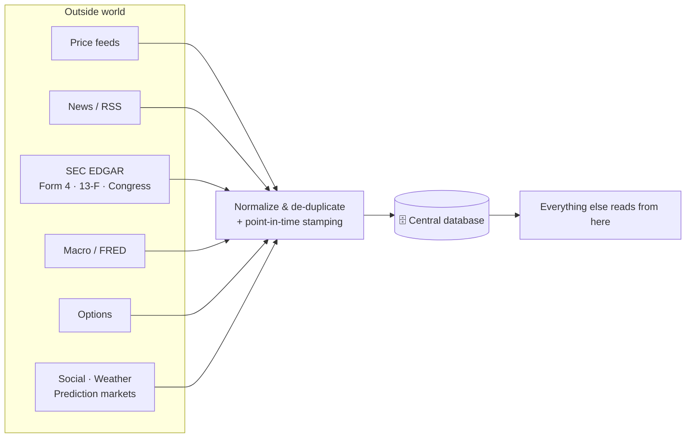
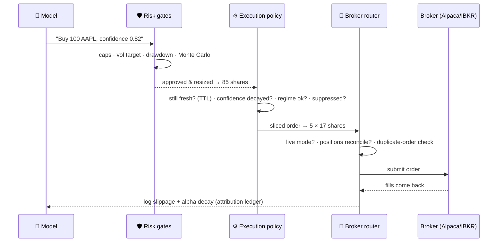
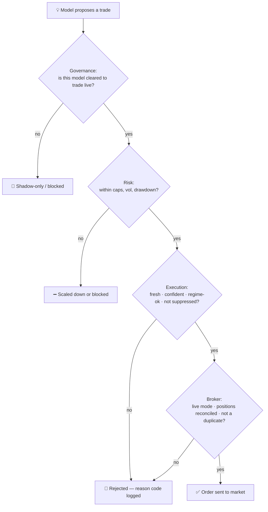
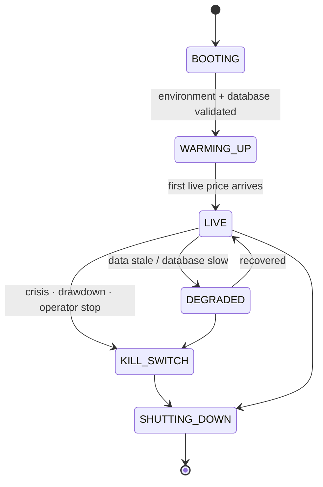
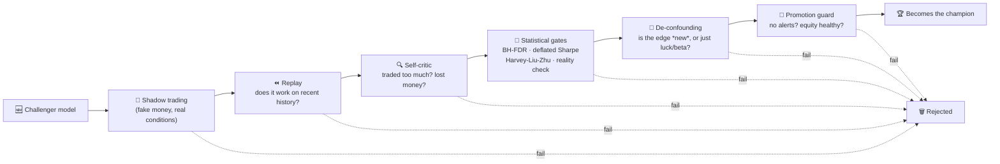
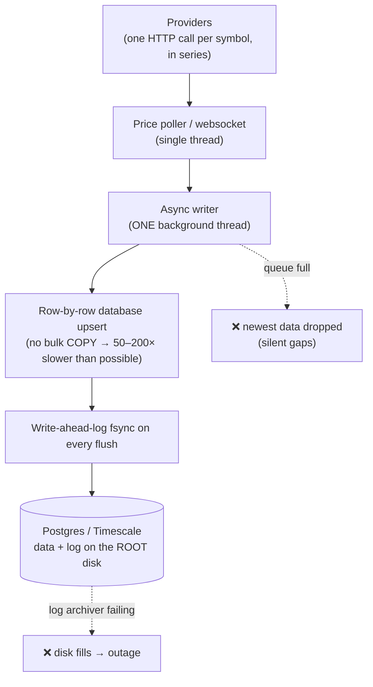

# Overview for Newcomers — The Trading System in Plain English

> **Who this is for:** brand-new team members, non-technical stakeholders, and anyone who wants the
> big picture before diving into the engineer docs.
> **What it is:** a plain-English, diagram-first tour of *what* this system does, *how* it does it,
> *why* it's good or not, and *what we'd improve*.
> **What it is not:** the authoritative spec. For that, start at
> [DOCUMENTATION_INDEX.md](DOCUMENTATION_INDEX.md) and [README_ARCHITECTURE.md](README_ARCHITECTURE.md).
>
> *Assessment in this document reflects the code and the June 2026 in-repo audits
> (`INGESTION_PERF_RELIABILITY_AUDIT.md`, `TEST_AUDIT_FINDINGS_AND_REMEDIATION.md`). New jargon is
> defined in the [Glossary](#15-glossary-plain-english).*

---

## 1. What this system is, in one paragraph

This is a **computer system that tries to make money trading financial markets**. It does three
things on a loop: (1) it constantly **reads a lot of data** (prices, news, company filings, social
chatter, economic numbers, and more); (2) it uses **machine-learning "analysts"** to guess what's
likely to go up or down; and (3) it **places trades** through real brokers. Wrapped around all of
that is a thick layer of **automatic safety checks** so that one bad guess, a market shock, or a
software bug can't blow up the account.

The long-term ambition (stated in the team's `CLAUDE.md`) is a fully autonomous "alpha discovery"
engine in the spirit of Renaissance Technologies or Two Sigma. **Today it is a *supervised* system:
the models *propose* trades, the runtime *decides* whether they're safe, and humans *approve* big
changes.** That distinction matters and shows up everywhere in the design.

---

## 2. The big picture (think of a factory assembly line)

The cleanest mental model is a **factory assembly line**: raw material comes in one side, gets
refined step by step, and finished product (a trade) comes out the other. A **referee** decides
which "analysts" are even allowed on the floor, and a **cockpit** lets humans watch everything and
hit the brakes.

```mermaid
flowchart LR
    subgraph SENSES["📡 Data Ingestion — the senses"]
      D1[Prices<br/>Polygon · IBKR · CCXT · yfinance]
      D2[News · SEC filings<br/>Social · Insider/Congress trades]
      D3[Macro · Options<br/>Weather · Prediction markets]
    end
    SENSES --> STORE[("🗄️ Postgres / TimescaleDB<br/><b>single source of truth</b>")]
    STORE --> FEAT["🧮 Features<br/>~111 live · ~1,700 in catalog"]
    FEAT --> BRAIN["🧠 Models<br/>LightGBM · XGBoost<br/>PatchTST · iTransformer"]
    BRAIN --> INTENT["💡 Model intent<br/>what · side · size · timing"]
    INTENT --> PORT["📊 Portfolio<br/>max 3 positions"]
    PORT --> RISK["🛡️ Risk gates<br/>caps · vol target<br/>drawdown · Monte Carlo"]
    RISK --> EXEC["⚙️ Execution policy<br/>freshness · alpha decay · slicing"]
    EXEC --> BROKER["🏦 Broker router<br/>Alpaca · IBKR · Sim"]
    BROKER --> MKT(("🌐 Market"))
    GOV["⚖️ Governance<br/>champion/challenger gates"] -. only approved models trade .-> BRAIN
    OPS["🖥️ Dashboard + Operator console"] -. watch and control .-> STORE
```

**How to read it:** data flows in on the **left**, becomes decisions in the **middle**, and turns
into trades on the **right**. The **referee** (Governance) decides which models are good enough to
risk real money. The **cockpit** (Dashboard + Operator) is how people see what's happening and stop
it if needed. Everything is wired through **one central database** — that's both a strength (one
source of truth) and a weakness (a single point of failure), as we'll see later.

---

## 3. The seven parts, in plain English

Each part below gets a one-line analogy, what it does, why it matters, and one strength + one watch-out.

### 3a. Data ingestion — *the senses* &nbsp;(`engine/data/`)
- **What:** continuously pulls in outside information — live prices, options, news, SEC filings
  (including insider and congressional trades), economic data, social media, weather, and even
  betting/prediction-market odds — then cleans and standardizes it.
- **Why it matters:** garbage in, garbage out. If the data is wrong, late, or accidentally contains
  "future" information, every model downstream is poisoned.
- **Clever bit:** it carefully tracks **point-in-time** — "what did we actually know, and *when*" —
  so that when we test a model on history, it can't cheat by peeking at information that didn't
  exist yet.
- **Watch-out:** this is the system's **biggest reliability weakness today** (see [§12](#12-where-its-weak-the-honest-risks)).

### 3b. Storage + control plane — *the nervous system* &nbsp;(`engine/runtime/`)
- **What:** one **Postgres/TimescaleDB** database is the single source of truth, and ~**133
  supervised "jobs"** (small programs) do all the work — polling prices, training models, running
  risk checks, etc. The control plane starts them, restarts them if they crash, prevents two copies
  of the same job from clashing (locks), tracks health, and recovers cleanly after a crash.
- **Why it matters:** a trading system that crashes and *forgets it has open orders* is dangerous.
  On restart, this system asks the broker "what do you think I own?" and reconciles before doing
  anything (**crash recovery**).
- **Strength:** graceful degradation — if one data feed goes stale it drops to a `DEGRADED` mode
  instead of panicking.
- **Watch-out:** *everything* depends on that one database. If it's slow or down, the whole system
  slows or stalls.

### 3c. Strategy / ML brain — *the analysts* &nbsp;(`engine/strategy/`)
- **What:** turns the cleaned data into **features** (~111 used live, ~1,700 in the full catalog),
  feeds them to several **machine-learning models** (LightGBM, XGBoost, a gradient-boosting model,
  and two time-series transformers, PatchTST and iTransformer), blends them with a "meta" model, and
  produces a single, standard **"model intent"**: *which symbol, buy or sell, how big, and when.*
- **Why it matters:** this is where the actual edge — the "alpha" — is supposed to come from.
- **Clever bit:** **train/serve parity** — the exact same features used to train a model are used to
  run it live, so it can't behave differently in production than in testing. It also reads the
  **market regime** in three layers (the big economy, the asset class, and second-by-second
  microstructure) and sizes bets accordingly.
- **Portfolio rule:** hold at most **3 positions** at a time, and don't "flip-flop" in and out of the
  same name (a minimum hold time prevents churn).
- **Watch-out:** the newest transformer models are less battle-tested than the boosting models, and a
  lot of the fancier "auto-discover new signals" machinery is **research-only**, not live.

### 3d. Governance — *the hiring committee / the referee* &nbsp;(`champion_manager.py`, `statistical_gates.py`, `cpcv.py`, `promotion_guard.py`, `deconfounded_promotion.py`)
- **What:** decides which models are good enough to trade real money. A new model is a **challenger**;
  it must beat the current **champion** through a gauntlet of tests before it's promoted.
- **Why it matters:** it's startlingly easy to build a model that looks brilliant on past data purely
  by luck. This layer exists to **stop the system from fooling itself.**
- **Strength:** the tests are **institution-grade** — the same statistical rigor serious quant funds
  use (more on this in [§7](#7-the-governance-gauntlet-how-a-bad-model-gets-caught)).
- **Watch-out:** the validation window is fairly short, and **auto-retraining on drift is detected
  but not yet auto-triggered** — a human still pulls that lever.

### 3e. Risk — *the safety harness* &nbsp;(`engine/risk/`)
- **What:** before any trade is sized, it passes through a cascade of caps and scalers — total
  exposure caps (gross ≤ 1.0×, net ≤ 0.6× of capital), a **2% daily volatility target**, caps on
  groups of stocks that move together (**correlation clusters**), a **6% drawdown throttle** that
  shrinks bets and a **15% hard block** that stops trading, plus a **Monte-Carlo simulation** (1,500
  imagined futures) estimating worst-case loss (VaR/CVaR).
- **Why it matters:** even perfect predictions are worthless if a single trade can wipe you out.
- **Key design principle:** risk only ever **scales positions *down*, never up**, and it **fails
  closed** — if anything is uncertain or broken, it blocks rather than allows.
- **Watch-out:** Monte-Carlo and correlation models lean on recent history; a true "black swan"
  (2008/2020-style) can break their assumptions.

### 3f. Execution + brokers — *the trading desk* &nbsp;(`engine/execution/`)
- **What:** turns an approved intent into actual broker orders. It checks the idea is still **fresh**
  (a "time-to-live"), that confidence hasn't **decayed**, that the market regime still fits, and that
  the system isn't in a **suppression** state; then it **slices** the order into smaller pieces
  (TWAP/VWAP/POV or a learned slicer) to avoid moving the market, and routes it through a **broker
  router** (Alpaca, Interactive Brokers, or a simulator) with automatic **failover**.
- **Why it matters:** sloppy execution silently bleeds money, and a duplicate or runaway order is a
  real-world hazard.
- **Strengths:** **durable, fail-closed kill switches** (they survive a reboot); a **pre-live position
  reconciliation** gate (won't trade live until the broker's view matches ours); and
  **duplicate-order protection** (idempotency) so a crash-and-restart can't accidentally trade twice.
- **Watch-out:** broker failover must be configured carefully and consistently, and execution
  decisions also depend on the database being responsive.

### 3g. Dashboard + operator — *the cockpit* &nbsp;(`dashboard_server.py`, `engine/api/`, `boot/`, `services/`)
- **What:** the human window into the system — live positions and profit/loss, alerts, kill-switch
  status, model performance, a browser-based trading terminal, and a separate local **operator
  console** that can launch, diagnose, and stop the runtime even if the main system is struggling.
- **Why it matters:** if a human can't *see* a problem or can't *stop* a runaway, none of the backend
  safety helps.
- **Strengths:** the browser terminal **does not bypass safety** — a manual order goes through exactly
  the same gates; the built-in **operator-AI is diagnostics-only** (it can suggest fixes but cannot
  act on its own); and credentials are **encrypted at rest**.
- **Watch-out:** the main dashboard file is very large (5,784 lines), which makes it harder to test
  and change safely.

---

## 4. Life of a trade (the end-to-end flow)

Here's what actually happens, start to finish, when a model wants to buy something.

Notice that the model's request is only the *start* of the conversation — it gets resized, re-checked
for freshness, sliced up, reconciled against the broker, and finally logged in detail so the team can
later ask "was that a good fill?"

---

## 5. The safety funnel (why most ideas never become trades)

A useful way to see the whole system is as a **funnel**: a model can *propose* anything, but each
layer can shrink it or stop it, and only ideas that clear *every* gate reach the market. Every
rejection is logged with a **reason code**, so nothing fails silently.

This is the single most important idea in the whole system: **the model never has the final say.**
The runtime owns every safety decision. That separation ("models propose, runtime decides") is what
makes it possible to experiment with bold models without betting the account on them.

---

## 6. The system's "moods" (lifecycle states)

The runtime is always in one clearly-defined state. This is how operators know, at a glance, whether
it's safe for the system to be trading.

| State | Plain meaning |
|---|---|
| **BOOTING** | Starting up; definitely not trading. |
| **WARMING_UP** | Up, but waiting for the first real price tick and for models to load. |
| **LIVE** | Healthy and allowed to place orders. |
| **DEGRADED** | Running but something's wrong (stale data / slow DB); reduced activity. |
| **KILL_SWITCH** | Emergency stop — no new orders; survives a reboot until a human re-arms it. |
| **SHUTTING_DOWN** | Clean, orderly stop in progress. |

---

## 7. The governance "gauntlet" (how a bad model gets caught)

This deserves its own diagram because it's one of the system's best features. A new model has to
survive a series of independent checks — each one designed to catch a different way a model can be
secretly bad — before it's allowed to trade real money.

In plain terms: the statistical gates ask *"is this performance real or just luck?"*, the
de-confounding step asks *"is this a genuinely new edge, or is the model just secretly riding the
overall market?"*, and the promotion guard does a final safety sweep. **This is the same kind of
rigor top quant funds use to avoid fooling themselves** — and it's a genuine strength of the system.

---

## 8. By the numbers (scale at a glance)

| Thing | Roughly |
|---|---|
| Application code | ~330,000 lines of Python |
| Engine subsystems | 21 (data, runtime, strategy, risk, execution, api, terminal, governance, …) |
| Background "jobs" | ~133 registered & supervised |
| Features | ~111 used live · ~1,700 in the full catalog |
| Live model families | 6 (LightGBM, XGBoost, GBM, PatchTST, iTransformer, Ridge meta-ensemble) |
| Automated tests | 2,068 tests across 339 files |
| Data store | a single Postgres / TimescaleDB database |
| Brokers supported | Alpaca, Interactive Brokers, and a simulator |

This is a **big, serious codebase** — not a prototype. That scale is itself a double-edged sword:
lots of capability, but a lot of surface area to keep healthy.

---

## 9. What's actually live vs. just "shadow" (the honesty box)

A lot of impressive-sounding capability exists in the code but is deliberately **not** wired to real
money yet. Knowing the difference saves a newcomer from overestimating the system.

| ✅ Genuinely live (can affect real trades) | 👻 Shadow / advisory only (no order authority) |
|---|---|
| LightGBM, XGBoost, GBM, PatchTST, iTransformer, Ridge ensemble | Reinforcement-learning trader |
| The full risk engine (caps, vol target, drawdown, Monte Carlo) | Prediction-market signals (Kalshi / Polymarket) |
| The full execution + broker + kill-switch stack | LLM-based "discover new signals" research |
| The governance gauntlet (champion/challenger) | Foundation-model time-series encoders |
| The dashboard + operator console | Operator-AI (diagnostics only) |
| | Learned execution slicer (off unless explicitly enabled) |
| | Auto-retrain on drift (detected, but human-triggered) |

**Bottom line:** the *trading* core is real and conservative; the *autonomy* and *auto-discovery*
ambitions are mostly still on the workbench. That's a sensible, safe order to build in.

---

## 10. Why it's GOOD

- **The right safety philosophy, enforced everywhere.** "Models propose, the runtime decides." Models
  never get direct order authority; risk only scales down and fails closed; kill switches survive
  reboots. This is exactly how you'd want a money-handling system designed.
- **Institution-grade model vetting.** The governance gauntlet (CPCV, deflated Sharpe,
  Harvey-Liu-Zhu, reality check, causal de-confounding) is rare rigor — most shops don't do this, and
  it's the main defense against trading a model that's merely lucky.
- **Deep, layered execution safety.** Position reconciliation before going live, duplicate-order
  protection, trade-suppression tiers, and automatic broker failover are all present and thoughtful.
- **Strong observability and human control.** Rich dashboards, a separate operator console that works
  even when the runtime is sick, encrypted credentials, and a bounded (non-autonomous) operator-AI.
- **A large, genuinely good test suite and thorough documentation.** 2,000+ tests with real
  negative-path coverage and good isolation, plus an organized engineer documentation set.

---

## 11. The single biggest weakness, visualized

The June 2026 performance audit found that **the path that gets data into the database is a
single-file line at every stage**, and that under load it **drops data rather than slowing down**.
This is the #1 thing holding the system back.

In plain terms: imagine a busy restaurant where **only one waiter** carries **one plate at a time**,
and when the kitchen gets backed up they **throw food away** instead of asking diners to wait. That
caps how many symbols the system can follow and quietly creates holes in the data — and the database
sitting on a too-small, mismanaged disk risks a **full outage**. Good news: the audit says these are
**localized fixes, not a rewrite.**

---

## 12. Where it's weak (the honest risks)

*From the two in-repo audits, June 2026.*

| # | Risk | Why it matters |
|---|---|---|
| 1 | **Ingestion can't scale & silently drops data** | No bulk-load (`COPY`), a single writer thread, ~500K rows can be lost on a hard crash, and no horizontal scaling. Caps the system at "a few dozen symbols, lossy under bursts." |
| 2 | **Infrastructure / outage risk** | The database files and transaction log sit on the root Docker disk while the log archiver is failing → the disk can fill and take the whole system down; point-in-time backups are broken. (A recurring, known issue.) |
| 3 | **The test *gate* is broken (not the tests)** | The highest-value safety tests (kill switch, broker failover, drawdown) aren't run at merge time; there's no coverage measurement (~24% of modules untested and invisible); the full suite only runs against SQLite, never production Postgres; and the advertised local test command silently runs ~42% of tests and still reports green. *"Tests exist, but they don't certify."* |
| 4 | **Single database = single point of failure** | Nearly everything is synchronous on one Postgres instance. If it's slow, the system is slow; if it's down, the system stalls. |
| 5 | **A few giant files** | `dashboard_server.py` (5,784 lines) and several 95–215 KB modules (`health.py`, `storage_pg.py`, `champion_manager.py`, `jobs_manager.py`) are hard to test and risky to change. |
| 6 | **Aspiration vs. reality** | Much advanced capability is shadow-only, and many important thresholds are hand-tuned settings rather than learned. The system is **not yet autonomous** — humans still approve promotions and react to drift. |

> **Fair framing for newcomers:** none of these are "the system is broken." It *works* and it's
> *carefully built*. The weaknesses are about **scale, reliability plumbing, and proving correctness
> automatically** — exactly the things that matter most before trusting it with more capital. Some
> interim mitigations are already in the code (e.g., the data writer now drains more gracefully on
> shutdown).

---

## 13. Recommendations (what to fix, in order)

```mermaid
flowchart LR
    subgraph P0["🔴 P0 — do now (money/reliability at risk)"]
      A1[Fix the ingestion spine:<br/>bulk COPY + writer pool +<br/>durable buffer]
      A2[Move DB + log off the root disk;<br/>alert before the disk fills]
      A3[Fix the test gate:<br/>run real suite on Postgres in CI +<br/>add coverage floors]
    end
    subgraph P1["🟠 P1 — next"]
      B1[Type-checking + property tests<br/>on the numeric core]
      B2[Direct tests for untested<br/>money-path modules]
      B3[Break up the giant files]
    end
    subgraph P2["🟡 P2 — later"]
      C1["Horizontal scaling for ingestion<br/>(sharding → streaming log)"]
      C2[Faster caching + pooled reads]
      C3[Pinned dependency lockfile;<br/>nightly soak/chaos tests]
      C4[Replace hand-tuned thresholds<br/>with learned parameters]
    end
    P0 --> P1 --> P2
```

- **🔴 P0 — money and reliability are at risk right now:**
  1. **Fix the ingestion spine** — switch to bulk database loading (`COPY`), use a small pool of
     writer threads, relax durability on the (re-fetchable) price path, and add a durable buffer so a
     crash doesn't lose data. This is the difference between "a few dozen symbols, lossy" and "the
     full universe, durable, fast."
  2. **Fix the infrastructure** — move the database files and transaction log off the root disk onto
     the proper storage volume, make the system refuse to start if they're misplaced, and alert on
     disk/archiver health *before* it fills.
  3. **Fix the test gate** — run the *real* test suite (including the safety/money-path tests) against
     production Postgres in CI, add coverage measurement with minimum floors on the risk/execution/
     runtime code, and repoint the advertised local test command so it stops lying about being green.
- **🟠 P1 — close the correctness gaps:** add automated type-checking and property-based tests on the
  numeric core (risk math, sizing, idempotency); write direct tests for the currently-untested
  money-path modules (broker failover, price storage, sizing, cap/drawdown, the panic circuit
  breaker); and start breaking the giant files into smaller, testable pieces.
- **🟡 P2 — scale and self-tuning:** give ingestion a horizontal-scaling path (sharding now, a
  streaming log like Kafka/Redpanda later); speed up hot reads (batched/cached/pooled); pin
  dependencies with a hashed lockfile and wire the existing soak/chaos tools into a nightly run; and,
  in line with the team's roadmap, replace hand-tuned settings with learned parameters over time.

---

## 14. If you're new here, read these next

1. [README.md](../README.md) — the canonical entry point and runtime topology.
2. [DOCUMENTATION_INDEX.md](DOCUMENTATION_INDEX.md) — the full map of all docs.
3. [README_ARCHITECTURE.md](README_ARCHITECTURE.md) — the deep architecture reference.
4. [README_SEQUENCE_DIAGRAMS.md](README_SEQUENCE_DIAGRAMS.md) & [STATE_MACHINES.md](STATE_MACHINES.md) — detailed flows and states.
5. [README_OPERATOR_GUIDE.md](README_OPERATOR_GUIDE.md) — if you'll be running the system.
6. The subsystem `README.md` inside whichever `engine/<area>/` folder you'll be working in.

---

## 15. Glossary (plain English)

| Term | What it means here |
|---|---|
| **Alpha** | A genuine, repeatable edge that makes money beyond just "the market went up." |
| **Feature** | A single input number a model looks at (e.g., "how fast prices moved in the last hour"). |
| **Model intent** | The model's standardized request: which symbol, buy/sell, how big, when. |
| **Champion / Challenger** | The currently-trusted model vs. a new candidate trying to replace it. |
| **Shadow mode** | Running for real-world evaluation but with fake money — no real orders. |
| **Point-in-time (PIT)** | Only using information that was actually known at the moment, so tests can't cheat. |
| **TTL ("time to live")** | How long a trade idea stays valid before it's considered stale and dropped. |
| **Alpha decay** | A model's confidence fading as time passes since the signal was generated. |
| **Slippage** | The difference between the price you expected and the price you actually got. |
| **Slicing (TWAP/VWAP/POV)** | Breaking a big order into small pieces over time so it doesn't move the market. |
| **Drawdown** | How far the account is down from its recent peak. |
| **VaR / CVaR** | Statistical estimates of "how bad could a bad day get." |
| **Gross / Net exposure** | Total size of all bets (gross) vs. long-minus-short direction (net). |
| **Kill switch** | A durable emergency stop that blocks trading until a human re-arms it. |
| **Idempotency** | A guarantee that the same order can't accidentally be placed twice. |
| **Fail-closed** | When in doubt, *stop* (block the trade) rather than risk doing the wrong thing. |
| **Reconciliation** | Cross-checking "what we think we own" against "what the broker says we own." |
| **Regime** | The current market mood/condition (calm vs. crisis, risk-on vs. risk-off). |
| **Drift** | A live model slowly getting worse as the world changes from when it was trained. |

---

*This overview is a companion to — not a replacement for — the engineer documentation. When the
system changes, update the relevant subsystem docs first; refresh this file when the big-picture
story or the risk assessment meaningfully changes.*
