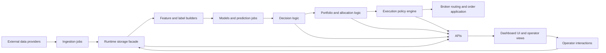
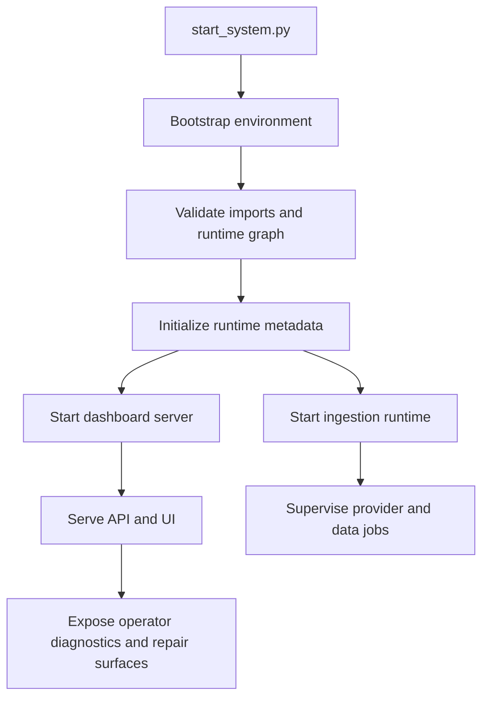
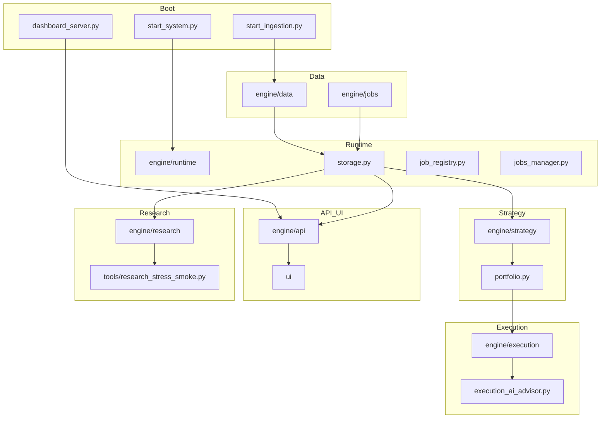

# Trading System Architecture

This document explains the repo in plain English.

Last verified against code: 2026-06-21

For the grounded, code-referenced architecture reference (exact entrypoints, control planes, and modules), see [ARCHITECTURE.md](ARCHITECTURE.md). This document is its plain-English companion.

If you want the shortest answer, this system is a supervised trading platform that:

- gathers market and external data
- turns those data into features, labels, predictions, and decisions
- converts decisions into portfolio and execution intents
- applies safety and policy checks before any execution path
- exposes everything through a dashboard and operator tooling

It is not just a model. It is a full runtime with ingestion, storage, orchestration, APIs, UI, monitoring, and control surfaces.

## 1. Big Picture

### What the system is trying to do

The repo is built to continuously answer this chain of questions:

1. What is happening in the market and in related external signals?
2. What signals or features matter right now?
3. What should the model or policy do?
4. How should the portfolio change?
5. Is that action safe, allowed, and operationally sane?
6. How should orders be executed?
7. What should the operator be shown?

### In one sentence

It is a trading engine plus a dashboarded operating system around that engine.

## 2. Main Layers

| Layer | Purpose | Main Files |
| --- | --- | --- |
| Boot and supervision | Starts the runtime, validates startup, launches services, tracks lifecycle | `start_system.py`, `dashboard_server.py`, `start_ingestion.py`, `engine/runtime/` |
| Storage and coordination | Runtime persistence facade, locks, runtime metadata, event logging | `engine/runtime/storage.py`, `engine/runtime/storage_pg.py`, `engine/runtime/locks.py`, `engine/runtime/runtime_meta.py` |
| Data ingestion | Pulls prices plus non-price sources; non-price feeds are normalized into the shared `events` layer before downstream use | `engine/data/`, `engine/jobs/`, `engine/runtime/ingestion_runtime.py` |
| Strategy and models | Builds features, labels, trains models, predicts, forms decisions | `engine/strategy/` |
| Portfolio and allocation | Turns decisions into target exposures and position changes | `engine/strategy/portfolio.py`, `engine/runtime/strategy_allocator.py` |
| Execution | Shapes, routes, and safeguards order flow | `engine/execution/` |
| Governance and safety | Promotion, replay, critic checks, kill switches, execution limits, model-level execution blocks | `engine/strategy/jobs/strategy_governance_job.py`, `engine/execution/kill_switch.py` |
| API and dashboard | Exposes state and controls to browser/operator users | `engine/api/`, `dashboard_server.py`, `ui/` |
| Operator repair and AI diagnostics | Packages runtime evidence for guided repair, bounded AI analysis, and guarded patch workflows | `boot/operator_server.js`, `boot/operator_ui.html`, `services/operator_ai/agent.js` |
| Research and stress testing | Offline scenario generation and fragility analysis | `engine/research/`, `tools/research_stress_smoke.py` |

## 3. Human Explanation Of The Runtime

Think of the repo as five connected loops:

1. Data loop
   New data are ingested and written locally.
2. Signal loop
   Features, labels, and predictions are built from those data.
3. Decision loop
   The system decides whether exposure should change.
4. Execution loop
   Orders are shaped, checked, and sent through broker logic.
5. Oversight loop
   Dashboard, alerts, governance, and operator actions observe and constrain the other four loops.

A newer sixth loop now exists around operator repair:

6. Repair loop
   Support snapshots, watchdogs, and operator AI summarize failures and recommend bounded recovery actions without bypassing runtime gates.

## 4. End-To-End Flow

## 5. Boot And Startup

### What starts first

The main top-level entrypoint is `start_system.py`.

Its job is to:

- normalize environment variables and paths
- load `.env`
- make sure the repo is running from the expected location
- set up logs and data directories
- validate imports and startup phases
- write startup trace metadata
- coordinate ingestion and the dashboard server

The dashboard is served by `dashboard_server.py`.

That file is the HTTP/UI boundary. It serves:

- browser assets from `ui/`
- dashboard APIs under `/api/...`
- runtime health and job-control reads
- post-bind bootstrap hooks

### Startup diagram

## 6. Storage Model

The persistent center of gravity is the runtime storage facade in `engine/runtime/storage.py`.
Current production-like storage is Postgres-backed through `engine/runtime/storage_pg.py`, selected and contract-validated by the facade before callers can use it. Older SQLite-era wording may still appear in historical docs or tests, but new storage behavior should be treated as a migration-backed runtime contract.

This matters because nearly every major subsystem reads from or writes to the same storage layer:

- data ingestion writes raw and derived market data
- non-price ingestion normalizes source-specific payloads into the canonical `events` table
- strategy jobs read data and write predictions or decisions
- portfolio and execution paths read those outputs and write actions
- the dashboard reads summaries and metadata
- operator interactions and new advisory logs now also persist there

### Why this file is critical

`engine/runtime/storage.py` is one of the most sensitive files in the repo because schema, query patterns, and write behavior influence almost every runtime path.

## 7. Job System And Orchestration

`engine/runtime/job_registry.py` is the canonical list of allowed jobs.

In plain terms, it is the system's schedule-and-launch catalog. It defines:

- what jobs exist
- where each job script lives
- whether it is a daemon or a normal job
- whether it belongs to a pipeline family
- metadata such as execution sensitivity

`engine/runtime/jobs_manager.py` and `engine/runtime/startup_orchestrator.py` then decide:

- what starts automatically
- what should stay supervised
- what the UI can start or stop
- how job status is reported

### Job model

| Concept | Meaning |
| --- | --- |
| Allowed job | A job that is registered and launchable by the runtime |
| Daemon job | Long-running background process |
| Pipeline job | One stage of a broader workflow |
| Boot job | A job expected to be present early in startup |
| Price feed job | A data-source job that keeps prices flowing |

## 7.1 Operator Diagnostics And Repair Snapshot

The operator layer now depends on a richer diagnostic contract than a simple health ping.

The main ownership is:

- `engine/api/api_system.py`
  builds support snapshots, provider telemetry, runtime watchdogs, and service-status payloads
- `boot/operator_server.js`
  proxies those diagnostics to the local operator UI and uses them as input to repair workflows
- `services/operator_ai/agent.js`
  consumes the snapshot package, returns strict JSON analysis, and limits actions to safe operator-side controls

The operator AI is therefore not a second autonomous runtime. It is a bounded consumer of the existing control-plane evidence.

## 8. Strategy Plane

The strategy layer lives mostly in `engine/strategy/`.

In human terms, this layer turns raw data into trading opinions.

Typical responsibilities include:

- feature generation
- labeling
- model training
- prediction
- confidence estimation
- decision logging
- governance and promotion checks

This is where the system goes from "what happened" to "what we think should happen next."

### Current model contract

The strategy plane is now more explicitly split into two contracts:

- model-owned decision intent
- system-owned safety and execution control

Canonical model intent now flows through `engine/strategy/model_intent.py` and is written by:

- `engine/data/jobs/process_events.py`
- `engine/data/jobs/process_events_live.py`
- `engine/data/jobs/process_events_enriched.py`

The canonical `model_intent` payload is the expected downstream decision surface for:

- whether the model wants to trade
- which side it wants
- whether to enter now or suppress trading
- target weight or sizing multiplier
- whether a symbol should be included in the universe
- feature ids selected by the model/schema

This moved the repo from hard-coded strategy heuristics toward model-defined trading intent while keeping the runtime supervised.

### Feature schema and train/serve parity

Feature selection is now schema-driven rather than purely env-flag-driven.

The important ownership is:

- `engine/strategy/feature_registry.py`
  resolves named features by id
- `engine/strategy/feature_expansion.py`
  assembles vectors and snapshots from explicit `feature_ids`
- `engine/strategy/predictor.py`
  loads the active model spec and serves against that schema
- `engine/model_registry.py`
  stores the active model contract in registry metrics
- `engine/strategy/models/lgbm_regressor.py`
  persists and validates LightGBM feature schemas
- `engine/strategy/models/xgb_regressor.py`
  persists and validates XGBoost feature schemas
- `engine/strategy/models/gbm_model.py` and `engine/strategy/gbm_regressor.py`
  own sklearn/GBM-style model artifacts
- `engine/strategy/models/patchtst.py`
  owns PatchTST artifacts and schema validation
- `engine/strategy/ensemble/ridge_meta.py`
  owns the deterministic Ridge meta-ensemble contract
- `engine/strategy/embed_regressor.py`, `engine/strategy/train_temporal_predictor.py`, and `engine/strategy/temporal_predictor.py`
  remain legacy/fallback schema-aware paths

In practical terms, training now writes a feature contract and serving reads that same contract back. Decision logs also persist the named feature snapshot used at inference time.

### Current feature inventory

`engine/strategy/feature_registry.py` is the source of truth. The default serving set is exactly 111 feature ids: 8 base ids plus 103 unified symbol-snapshot ids when `USE_SYMBOL_SNAPSHOT_FEATURES=1` (the default). The full registered catalog is larger, about 1,762 ids without shadow groups and about 1,802 with shadow groups, because optional and shadow groups include NLP embeddings, filings, transcripts, tsfresh, symbolic/discovered features, time-series foundation-model embeddings, and other opt-in surfaces. The larger catalog is the opt-in/shadow superset, not the default serving surface; `tests/test_feature_default_count_parity.py` pins the 111-id serving count.

Current groups visible in the registry include:

- base, price, events, macro, HMM regime, tech, stress, social, weather, options-symbol, and availability
- FX groups under the shared `fx.` prefix: rate/real-yield spreads, carry, DXY/dollar beta, cross-pair correlation, COT positioning, trend/time-series momentum, and central-bank/event-window flags
- tsfresh and discovery-backed features
- NLP/FinBERT/news, filings, and transcript feature groups
- shadow-only `tsfm.chronos_v2.*` embeddings from the frozen Chronos encoder path when `USE_TS_FOUNDATION_FEATURES=1` and optional dependencies are installed
- optional insider/Form 4, congressional, sentiment, and symbolic feature paths when their flags and dependencies are enabled

Every new feature still needs an explicit feature id and must round-trip through the persisted feature schema.
FX feature groups are registered in the catalog but only enter an FX model schema when `USE_FX_FEATURES=1` or an FX model explicitly requests an `fx.*` id. `resolve_feature_ids(..., asset_class="FX")` and `expected_columns(..., asset_class="FX")` drop equity-only options/social/insider/filing-style ids and append the canonical FX ids in registry order; non-FX asset classes drop `fx.*` ids; `asset_class=None` preserves the legacy ungated behavior. The `fx.event_*` ids are a deliberate structural-zero stub until an upstream economic-calendar feed owns central-bank, NFP, and CPI event timestamps.
The Chronos foundation-model path is a feature generator only: it stores model-family provenance, artifact manifest hashes, and PIT source timestamps in the feature snapshot metadata, and live model serving rejects contracts that include shadow-stage feature ids.

### FX clock, labels, and regime context

`engine/data/prices/fx_clock.py` is the canonical FX session-boundary helper for this workstream. It defines the 24/5 FX week in `America/New_York` time, with the default weekend close at Friday 17:00 ET and reopen at Sunday 17:00 ET. FX execution/session and UI surfaces should derive from that module or use the same env knobs so ET boundaries and their DST-dependent UTC equivalents stay aligned.

FX label construction uses that clock only for symbols classified as `FX`. Non-FX labels still use the legacy fixed millisecond horizon. FX forward-return windows that would naively span the Friday-to-Sunday market-closed gap are skipped instead of being paired with stale post-gap prices; price-backfill labels that use the FX clock record `meta_json.fx_clock_corrected` and `meta_json.naive_eval_ms` on the sqlite-side `labels_price` enrichment path.

The regime stack can add a default-off `USE_FX_REGIME=1` USD-strength/carry layer for FX symbols. Those signals are merged into the existing `macro` regime layer as `fx_usd_strength_z`, `fx_usd_strength_dir`, and `fx_carry_pressure`, so `regime_compatibility` sees them without changing the persisted HMM training input keys. Predictor routing uses an FX symbol as the regime anchor for FX predictions; equities and other asset classes keep the existing `SPY` regime anchor.

### Futures continuous labels and roll-aware validation

Production futures labels must be computed from ratio-adjusted front continuous bars in `futures_continuous_bars`, not raw front-month rows in `prices`. `engine/data/jobs/label_due_events.py` branches only for symbols recognized by the futures instrument parser or `asset_class_for_symbol(...)=FUTURES`; those windows use the shared futures label-window guard in `engine/data/futures_roll.py` to skip known futures session gaps and any label window crossing a stored `futures_roll_calendar` boundary. Missing continuous bars or missing roll-calendar rows for the futures root are fail-closed: the label is not written instead of falling back to raw prices.

CPCV/model-validation paths consume the same roll calendar. `engine/data/futures_roll.py` exposes the read helpers for canonical continuous aliases and roll-boundary loading; `engine/strategy/jobs/backtest_cpcv.py` and the model-v2/meta-label CPCV calibration paths pass those roll timestamps into `CombinatorialPurgedKFold`, which purges train samples whose label windows straddle a futures roll. Equity/FX/crypto validation remains unchanged when no roll boundaries are supplied.

### Current model families

The current code centers on:

- LightGBM: `engine/strategy/models/lgbm_regressor.py`, trained by `engine/strategy/jobs/train_lgbm_models.py`
- XGBoost: `engine/strategy/models/xgb_regressor.py`, trained by `engine/strategy/jobs/train_xgb_models.py`
- sklearn/GBM-style regressors: `engine/strategy/models/gbm_model.py`, `engine/strategy/gbm_regressor.py`, `engine/strategy/jobs/train_gbm_regressor.py`
- PatchTST: `engine/strategy/models/patchtst.py`, trained by `engine/strategy/jobs/train_patchtst_models.py`
- iTransformer: `engine/strategy/models/itransformer.py`, trained by `engine/strategy/jobs/train_itransformer_models.py` as a shadow-default modern time-series challenger
- Ridge meta-ensemble: `engine/strategy/ensemble/ridge_meta.py`, `engine/strategy/jobs/train_ensemble_meta.py`, and `engine/strategy/jobs/train_ensemble.py`

Legacy schema-aware paths for embed regressors, temporal predictors, and regime/statistical baselines still exist, but they are not the only or primary model description anymore.

### Promotion, backtesting, and HPO reality

Promotion evidence now flows through the existing champion/challenger path rather than a parallel gate system:

- `engine/strategy/promotion_guard.py` applies White's Reality Check, BH-FDR/Harvey-Liu-Zhu statistical gates, pool-correlation and marginal-portfolio-contribution gates, and era/regime robustness checks.
- `engine/strategy/cpcv.py` provides CPCV/PBO, deflated Sharpe, cost-adjusted metrics, retrain-cadence replay, and an option to route evaluation through gated backtests.
- `engine/strategy/gated_backtest.py` replays intents through the live portfolio/execution-policy/broker-sim path for promotion-grade evaluation. Futures symbols additionally reuse the existing `portfolio_backtest` point-value transition-cost estimator, so the series passed to the statistical promotion gate is net of futures tick slippage and roll costs when those futures cost controls and runtime price/roll rows are available.
- `engine/strategy/optuna_tuner.py` integrates Optuna tuning and parameter-surface robustness checks.

### How machine learning works end to end

The trading ML path in this repo is intentionally split into clear phases:

1. data preparation
   ingestion jobs write prices, events, labels, embeddings, PIT universe rows, and related derived features into runtime storage
2. training
   model-family-specific jobs train artifacts such as LightGBM, XGBoost, sklearn GBM, PatchTST, iTransformer, Ridge ensemble, and legacy/fallback models
3. provenance capture
   training writes `feature_ids`, `feature_set_tag`, `feature_schema`, dataset snapshots, and version metadata into the registry/lifecycle surfaces
4. live model selection
   the predictor resolves which model should serve by consulting champion assignments, registry state, and configured defaults
5. inference
   the selected adapter runs with the persisted feature contract, then emits prediction plus explain data
6. supervised decision use
   portfolio, risk, and execution layers consume model intent, but they still own the final safety gates

That last point matters: the model proposes; the runtime decides what is actually allowed.

### Data ingestion job inventory

The current data job directory includes price/news/event processing plus newer alternative-data and feature-generation jobs, including:

- `ingest_now.py`, `poll_macro.py`, `earnings_poll.py`, `sec_poll.py`, `gdelt_poll.py`
- social jobs for Reddit and StockTwits
- weather forecast and alert polling/ingestion jobs
- options ingestion and calibration jobs
- `backfill_universe_pit.py` and `update_universe.py`
- Form 4 and congressional trade ingestion jobs
- event processors for base, live, enriched, and shadow paths
- `process_finbert_sentiment.py`, `snapshot_model_features.py`, and `compute_tsfresh_snapshots.py`

### What "AI" means in this repo

There are three different AI/ML concepts in the codebase:

- trading ML
  the predictive models in `engine/strategy/` that generate trading intent
- execution AI advisory
  the advisory-only layer in `engine/execution/execution_ai_advisor.py` that comments on execution quality but does not control orders
- operator AI
  the bounded diagnostic assistant in `services/operator_ai/agent.js` that analyzes runtime failures and suggests guarded repair actions

Only the first one affects trading signals. The other two are read-side or advisory layers.

## 9. Portfolio And Allocation

After predictions exist, the system still needs to answer a harder question:

"Even if a trade looks good, how much capital should actually move?"

That is the role of the portfolio/allocation path.

The core logic is centered around files like:

- `engine/strategy/portfolio.py`
- `engine/runtime/strategy_allocator.py`
- `engine/runtime/hierarchical_allocator.py`

This layer decides:

- what target weights should be
- how much current positions should change
- how to cap or compress exposure
- how to respect broader portfolio risk limits

### Model-directed decisions versus safety controls

`engine/strategy/portfolio.py` now accepts canonical model intent for:

- symbol selection
- signal strength
- trade timing
- target weight and sizing hints

`engine/data/universe_discovery.py` and `engine/strategy/universe_selector.py` also allow model-promoted symbols to influence the tradable universe.

That does not give the model direct order authority.

The portfolio and execution stack still owns:

- hard exposure caps
- risk gates
- kill-switch behavior
- execution realism and liquidity checks
- final order shaping and routing

### Allocation overlay behavior

The current repo includes an allocation overlay for:

- crowding pressure
- top-name concentration pressure
- execution-capacity pressure

These overlays reshape candidate weights before the rest of the existing risk path takes over.

## 10. Execution Plane

The execution layer turns portfolio intent into broker-compatible action.

Main responsibilities:

- shape or slice orders
- apply execution policies
- route to broker adapters
- enforce kill switches and safety checks
- model-level kill switches are evaluated inside the existing execution kill-switch path and remain additive to the global switch
- store execution outcomes and analytics

Core files include:

- `engine/execution/broker_router.py`
- `engine/execution/execution_policy_engine.py`
- `engine/execution/broker_apply_orders.py`
- `engine/execution/kill_switch.py`

### Execution advisory

The repo also has an advisory sidecar in:

- `engine/execution/execution_ai_advisor.py`

This does not control orders directly.

It produces recommendations such as:

- urgency suggestions
- expected slippage warnings
- evidence from recent fills and execution analytics
- operator-approvable advisory records

That means the execution path gained more insight without handing authority to a second autonomous execution engine.

## 11. Governance And Safety

This repo is designed as a supervised system, not an unbounded automation loop.

Safety surfaces include:

- model and strategy governance jobs
- replay and promotion checks
- kill switches
- read-only mode and policy UI

This remains true after the model-intent and schema changes.

The model can now decide more of the "what" and "why":

- what symbols to favor
- what features to use
- when to trade
- desired position sizing

The system still decides the final "whether allowed" and "how executed".
- runtime health and error summaries
- operator oversight panels

### Governance extension

The current architecture includes:

- governance snapshots and logs
- dashboard governance summaries
- better visibility into champion/challenger style state
- richer summary of replay freshness, critic blocks, and shadow-capital signals

The important point is that governance was integrated into the current architecture rather than added as a parallel framework.

### How champion and challenger work

The champion/challenger system is the repo's supervised model-selection loop.

In practical terms:

1. training produces candidate model versions
2. challengers generate shadow predictions or shadow orders without taking live execution authority
3. marketplace scoring converts those shadow outcomes into comparable score rows
4. replay validation checks whether the challenger still looks acceptable on recent historical evidence
5. self-critic and runtime degradation checks can block a candidate even if its raw score is strong
6. `champion_manager.py` compares the current champion and the best eligible challenger
7. if the challenger is approved and materially better, it can replace the champion
8. if the champion degrades badly enough, it can be demoted or replaced even without a simple score win
9. the final durable state is written into champion assignments and model-registry state, which the predictor reads at serve time

So the champion is not simply "the latest model." It is the latest model that passed the competition, safety, replay, and cooldown rules.

## 12. Dashboard And Operator Layer

The dashboard lives in `ui/` and is served by `dashboard_server.py`.

The browser UI is not cosmetic. It is part of the operating model.

It gives operators visibility into:

- runtime health
- jobs
- alerts
- portfolio state
- execution state
- governance state
- decisions
- human-alignment analytics
- execution advisories

### UI structure

| UI Area | What it is for |
| --- | --- |
| `dashboard.html` | Main shell and panel layout |
| `dashboard.js` | Main dashboard behavior, loading, and interactions |
| `alerts_ui.js` | Alert-focused behavior |
| other panel JS files | Focused dashboard modules for specific data domains |

## 13. Current Integrated Feature Set

The current repo integrates these capabilities into its existing structure
rather than treating them as parallel subsystems.

### What is now present

| Feature | What it does now |
| --- | --- |
| Decisions UI | Shows recent decisions and drilldown details in the dashboard |
| Operator interaction logging | Records alert and decision opens, closes, and acknowledgements |
| Human alignment analytics | Summarizes operator behavior and identifies noisy or low-value alerts |
| Execution AI advisory | Produces non-authoritative execution advice with evidence and audit actions |
| Governance summary | Surfaces promotion/safety state in one dashboard view |
| Allocation risk overlay | Applies crowding, concentration, and execution-capacity pressure to candidate weights |
| Research stress tooling | Generates offline stress scenarios and fragility checks |

### What was intentionally not merged 1:1

- a separate legacy capital allocation engine
- a separate legacy governance subsystem
- automatic alert-threshold mutation
- authoritative AI-controlled execution
- the standalone legacy research budget allocation mini-platform

## 14. Repo Diagram

## 15. How To Explain This Repo To A Non-Engineer

If you need a short non-technical explanation, use this:

> This repository runs an automated trading operation with human supervision. It collects data, turns those data into model-driven trade ideas, converts those ideas into portfolio changes, applies safety and execution rules, and gives operators a dashboard to monitor and control the whole process.

## 16. Recommended Reading Order

If you are new to the repo, read in this order:

1. `README.md`
2. `README_ARCHITECTURE.md`
3. `README_SEQUENCE_DIAGRAMS.md`
4. `README_OPERATOR_GUIDE.md`
5. `README_DEVELOPER_MAP.md`
6. `start_system.py`
7. `dashboard_server.py`
8. `engine/runtime/job_registry.py`
