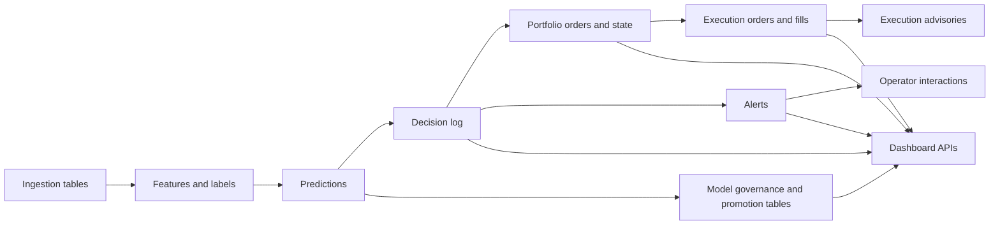

# Trading System Database Map

This document explains the main SQLite database used by the repo in human terms.

It is not meant to replace the schema in `engine/runtime/storage.py`. It is meant to make the schema understandable.

If you want the short version:

- the database is the shared memory of the system
- ingestion writes market and external data into it
- strategy jobs read those data and write predictions and decisions
- portfolio and execution logic write actions and outcomes
- the dashboard reads summaries from the same store
- operator interactions, advisories, and governance snapshots now also live there

## 1. Where The Database Lives

The database path is resolved by `engine/runtime/storage.py`.

In a normal local setup, the main file is usually:

- `data/trading.db`

That file is the primary runtime persistence layer for the platform.

## 2. How To Think About The Schema

The easiest way to understand the schema is as a set of table families.

| Table Family | What it stores |
| --- | --- |
| Runtime and control | health, metadata, jobs, locks, audit state |
| Market and ingestion | prices, quotes, options, provider health, raw event data |
| Features and labels | model inputs, derived features, target labels |
| Models and governance | model registry, promotion audit, drift, governance snapshots |
| Decisions and alerts | system decisions, alerts, acknowledgements, operator interactions |
| Portfolio and risk | target weights, equity, risk snapshots, suppression state |
| Execution | orders, fills, execution policy audits, execution health |
| Dashboard and operator | decision views, interaction logs, advisory actions |
| Research and evaluation | backtests, walk-forward runs, validation scores, stress outputs |

## 3. Main Data Flow



## 4. Core Tables You Should Understand First

If you only learn ten tables, learn these first.

| Table | What it means |
| --- | --- |
| `prices` | simple market price history by symbol and timestamp |
| `events` | external or derived event records |
| `predictions` | model output by symbol and horizon |
| `decision_log` | the system's recorded trading decisions and explanations |
| `alerts` | alert records emitted by rules or policy surfaces |
| `portfolio_state` | current target or held portfolio state by symbol |
| `portfolio_orders` | intended portfolio transitions |
| `execution_orders` | order submissions and broker-facing metadata |
| `execution_fills` | realized execution outcomes |
| `runtime_meta` | small shared key/value runtime state |

## 5. Table Families

### Runtime And Control Tables

These tables support orchestration rather than trading logic directly.

| Table | Role |
| --- | --- |
| `runtime_meta` | small key/value state used across the runtime |
| `job_history` | start/stop/error history for jobs |
| `job_locks` | coordination for jobs that must not overlap |
| `job_heartbeats` | liveness data from running jobs |
| `job_checkpoints` | progress checkpoints for resumable or tracked jobs |
| `event_log` | structured runtime event stream |
| `event_log_state` | event-log cursor/state tracking |
| `runtime_metrics` | general metric points for system visibility |
| `schema_version` | schema version bookkeeping |

### Market And Ingestion Tables

These tables hold raw or near-raw market and provider inputs.

For the live-ingestion family, schema ownership lives in `engine/runtime/storage.py`.
`init_db()` and its storage-owned repair helpers create and migrate `prices`, `price_quotes`,
`price_quotes_raw`, `price_provider_health`, `ingestion_pipeline_health`,
`price_feed_lock`, and `options_symbol_ingestion_state`; `poll_prices.py` and
`options_poll.py` should only read or write rows against those tables.
Repository validation now also blocks new DDL for that owned family outside the
approved owner modules, and runtime validation treats unexpected columns, primary-key
drift, or missing owned indexes on those tables as contract failures.

| Table | Role |
| --- | --- |
| `prices` | simple price points |
| `price_quotes` | top-of-book or quote-like market state |
| `price_quotes_raw` | provider-specific raw quote captures |
| `price_feed_lock` | single-writer coordination row for the canonical polling price feed path |
| `price_bars` | aggregated time-bucketed bar data |
| `price_provider_health` | buffered provider freshness and health state; non-authoritative telemetry alongside canonical `prices` inputs |
| `ingestion_pipeline_health` | per-pipeline liveness and ingest-volume snapshots for startup checks and operator diagnostics |
| `options_symbol_ingestion_state` | options-ingestion retry, cooldown, and fallback state per underlying symbol |
| `market_microstructure_signals` | spread, liquidity, and microstructure-derived signals |
| `options_chain`, `options_chain_v2` | option chain snapshots |
| `options_surface`, `options_surface_agg` | derived options surface data |
| `options_symbol_features`, `options_event_features` | symbol-linked options summaries and event-linked options signals derived from chain snapshots |
| `events` | canonical normalized non-price event layer across news, social, filings, earnings, weather, and macro-style signals |
| `earnings_calendar` | earnings source table feeding normalized `events` |
| `sec_filings` | filings source table feeding normalized `events` |
| `social_posts`, `social_features`, `social_regimes` | social-source raw and derived features; raw social events are also normalized into `events` |
| `weather_forecast_region_daily`, `weather_alerts`, `weather_provider_health` | weather source tables and provider state; alert/forecast events are also normalized into `events` |
| `gdelt_macro_features` | macro/event-style derived features built from normalized news/macro events |

### Features, Labels, And Prediction Tables

These tables sit between raw data and trade decisions.

| Table | Role |
| --- | --- |
| `market_features` | feature rows derived from market data |
| `labels` | training labels for strategy/model training |
| `labels_exec` | execution-specific labels |
| `predictions` | model predictions used by downstream logic |
| `temporal_predictions` | temporal-model outputs |
| `event_embeddings` | stored embedding vectors or references for event content |
| `event_embeddings_seq` | sequence bookkeeping for embeddings |
| `factor_features` | factor-style features |
| `factor_observations` | raw factor observations |
| `factor_group_scores` | grouped factor scoring |

### Models, Drift, And Governance Tables

These tables answer:

- what models exist
- which model is active
- whether promotion was allowed
- whether drift or governance issues are showing up

| Table | Role |
| --- | --- |
| `model_registry` | canonical registry of models |
| `champion_assignments` | active champion selections |
| `model_marketplace_scores` | model ranking or marketplace-style scoring |
| `model_promotion_audit` | promotion and rollback-style audit trail |
| `model_promotion_cooldown` | cooldown gates after promotion activity |
| `model_post_promo_watch` | models under watch after promotion |
| `model_post_promo_results` | watch results after promotion |
| `model_promotion_guard` | promotion guard state |
| `model_governance_log` | governance snapshots and summary payloads |
| `model_drift` | model drift data |
| `feature_distribution_drift` | feature distribution drift |
| `residual_distribution_drift` | residual drift |
| `self_critic_alerts` | model self-critic warning records |
| `shadow_predictions`, `shadow_metrics`, `shadow_training_runs` | shadow-model evaluation path |
| `challenger_shadow_orders` | challenger shadow trading decisions or outcomes |

### Decisions And Alerts Tables

These tables are closest to the "thinking" and "warning" surfaces of the system.

| Table | Role |
| --- | --- |
| `decision_log` | recorded decisions, explanations, and feature context |
| `alerts` | alert records shown to operators or consumed by policies |
| `alert_acks` | acknowledgement actions |
| `alert_resolutions` | alert closure or resolution records |
| `alert_interactions` | passive UI/operator interaction tracking |
| `decision_views` | decision detail view logging |
| `rules_audit` | audit records for rule-related changes or evaluations |
| `trade_decision_snapshot` | snapshot of decision context attached to trade logic |

### Portfolio And Risk Tables

These tables answer:

- what the portfolio currently is
- what it is trying to become
- what risks or suppressions are active

| Table | Role |
| --- | --- |
| `portfolio_state` | current portfolio exposure by symbol |
| `portfolio_orders` | intended portfolio changes |
| `portfolio_equity_state` | total portfolio equity history/state |
| `portfolio_risk_snapshots` | periodic portfolio risk snapshots |
| `portfolio_kill_snapshots` | kill-state portfolio snapshots |
| `risk_state` | compact current risk state |
| `risk_events` | risk incidents and warnings |
| `size_policy`, `size_policy_points` | sizing policy and its time series |
| `strategy_metrics` | strategy-level performance/health metrics |
| `strategy_allocations` | capital allocated by strategy |
| `strategy_allocator_scores` | allocator scoring inputs or outputs |
| `strategy_allocator_history` | allocator history |
| `strategy_cooldowns` | strategy-level cooldown state |
| `sleeve_metrics`, `sleeve_allocations`, `sleeve_registry` | sleeve-level capital and performance tracking |
| `shadow_capital_scores` | shadow allocation scoring |
| `trade_suppression_state`, `trade_suppression_audit` | suppression decisions and audit |
| `suppression_opportunity` | possible suppression events/opportunities |

### Execution Tables

These tables track order handling and realized market interaction.

| Table | Role |
| --- | --- |
| `execution_orders` | execution intent and broker submission record |
| `execution_fills` | realized fills and slippage/latency |
| `exec_open_orders` | current open order state |
| `exec_order_events` | order lifecycle events |
| `execution_policy_audit` | policy shaping or gating audit |
| `execution_mode` | current execution mode state |
| `execution_mode_audit` | changes to execution mode |
| `execution_health_state` | summary execution health |
| `execution_alerts` | execution-specific alerting |
| `execution_order_idempotency` | duplicate-protection and order lifecycle safety |
| `execution_divergence` | divergence between expected and actual execution state |
| `broker_fills` | broker-specific fill records |
| `broker_order_state` | broker order snapshots |
| `broker_connection_health` | broker health and connectivity state |
| `broker_account`, `broker_positions`, `broker_meta` | broker-facing account and position snapshots |

### Operator And Advisory Tables

These tables support operator-facing observability and advisory workflows in the current schema.

| Table | Role |
| --- | --- |
| `alert_interactions` | logs alert and decision UI interactions |
| `decision_views` | tracks decision detail opens |
| `execution_ai_advisory` | non-authoritative execution advice records |
| `execution_ai_advisory_actions` | operator approval/rejection audit for advisories |
| `model_governance_log` | dashboard-facing governance summary snapshots |

### Research And Evaluation Tables

These tables support offline analysis more than live control.

| Table | Role |
| --- | --- |
| `backtest_scores` | backtest outputs |
| `walk_forward_runs`, `walk_forward_scores` | walk-forward evaluation |
| `validation_scores` | validation results |
| `model_metrics` | model performance summaries |
| `embed_model_eval`, `embed_conf_calib` | embedding/evaluation calibration tables |
| `temporal_model_eval` | evaluation for temporal models |

## 6. Important Table Shapes

Below are the most important tables in simplified column form.

### `decision_log`

This is the main "why did the system decide that?" table.

| Column | Meaning |
| --- | --- |
| `id` | decision identifier |
| `ts_ms` | time of decision |
| `event_id` | upstream event linkage if any |
| `symbol` | asset or symbol |
| `horizon_s` | decision horizon |
| `predicted_z` | prediction magnitude |
| `confidence` | confidence estimate |
| `model_name` | originating model |
| `model_kind` | model family/kind |
| `features_json` | feature payload |
| `explain_json` | explanation payload |
| `extra_json` | extra context |

### `alerts`

This is the main warning/attention table for operators and policy layers.

| Column | Meaning |
| --- | --- |
| `id` | alert identifier |
| `ts_ms` | alert time |
| `symbol` | affected symbol |
| `severity` | alert severity |
| `rule_id` | originating rule |
| `prediction_id` | typed upstream prediction linkage for the covered trade chain |
| `expected_z` | expected move estimate if relevant |
| `confidence` | confidence estimate if relevant |
| `title`, `message` | human-readable alert text |
| `status` | lifecycle state |
| `detail_json` | detailed payload |

### `portfolio_state`

This is the compact current portfolio state by symbol.

| Column | Meaning |
| --- | --- |
| `symbol` | symbol |
| `side` | long/short/flat style side |
| `weight` | current target or held weight |
| `opened_ts_ms` | original open time |
| `updated_ts_ms` | last update time |
| `source_alert_id` | upstream alert linkage |
| `explain_json` | explanation payload |

### `portfolio_orders`

This table records intended changes to the portfolio.

For the covered trading chain, `source_alert_id` and `prediction_id` are typed lineage columns backed by SQLite constraints. JSON remains audit context only.

| Column | Meaning |
| --- | --- |
| `id` | order/change identifier |
| `ts_ms` | creation time |
| `symbol` | symbol |
| `action` | increase, reduce, flip, close, and similar |
| `from_weight` | previous weight |
| `to_weight` | new target weight |
| `delta_weight` | change size |
| `source_alert_id` | upstream alert linkage |
| `prediction_id` | upstream prediction linkage for the covered trade chain |
| `explain_json` | why the change was requested |

### `execution_orders`

This is the execution-intent table.

For the covered trading chain, `portfolio_orders_id`, `source_alert_id`, and `prediction_id` are enforced typed lineage columns. `extra_json` should mirror that lineage, not define it.

| Column | Meaning |
| --- | --- |
| `client_order_id` | client-facing order id |
| `broker` | broker destination |
| `portfolio_orders_id` | upstream portfolio order linkage |
| `source_alert_id` | upstream alert linkage |
| `prediction_id` | upstream prediction linkage |
| `symbol` | symbol |
| `qty` | submitted quantity |
| `submit_ts_ms` | submit timestamp |
| `expected_px` | expected execution price |
| `mid_px`, `bid_px`, `ask_px` | market reference prices |
| `spread_bps` | spread estimate |
| `status` | lifecycle status |
| `extra_json` | extra execution context |

### `execution_fills`

This is the realized execution-outcome table.

For the covered trading chain, `portfolio_orders_id`, `source_alert_id`, and `prediction_id` are enforced typed lineage columns. `raw_json` and `extra_json` remain secondary audit context.

| Column | Meaning |
| --- | --- |
| `client_order_id` | order linkage |
| `fill_id` | broker fill id |
| `portfolio_orders_id` | upstream portfolio order linkage |
| `source_alert_id` | upstream alert linkage |
| `prediction_id` | upstream prediction linkage |
| `symbol` | symbol |
| `fill_ts_ms` | fill time |
| `fill_qty` | filled quantity |
| `fill_px` | fill price |
| `expected_px` | expected price |
| `slippage_bps` | realized slippage |
| `fill_latency_ms` | latency to fill |
| `fees`, `commission` | execution cost |
| `raw_json`, `extra_json` | extra broker/context payload; secondary audit context, not the primary lineage contract |

### `execution_ai_advisory`

This is an operator-facing advisory table.

| Column | Meaning |
| --- | --- |
| `id` | advisory id |
| `ts_ms` | advisory time |
| `portfolio_orders_id` | upstream portfolio order linkage |
| `broker` | broker context |
| `symbol` | symbol |
| `side` | side |
| `aggressiveness` | suggested aggressiveness |
| `urgency` | suggested urgency |
| `recommendation` | short recommendation |
| `expected_slippage_bps` | estimated slippage |
| `confidence` | confidence in advice |
| `approved`, `rejected` | operator action flags |
| `rationale` | explanation text |
| `features_json` | feature evidence |
| `advisory_json` | full structured advisory payload |

### `model_governance_log`

This is the current dashboard-facing governance summary table.

| Column | Meaning |
| --- | --- |
| `id` | row id |
| `ts_ms` | snapshot time |
| `source` | governance source |
| `regime` | regime context |
| `champion_name` | active champion |
| `challenger_name` | active challenger |
| `status` | summary status |
| `summary_json` | detailed summary payload |

## 7. Operator Observability And Advisory Tables

The following tables are the operator-observability and advisory tables that matter most when tracing UI interactions or advisory workflows:

| Table | Why it was added |
| --- | --- |
| `alert_interactions` | to learn how operators engage with alerts and decisions |
| `decision_views` | to measure decision-detail usage |
| `execution_ai_advisory` | to persist advisory-only execution guidance |
| `execution_ai_advisory_actions` | to audit operator approval/rejection |
| `model_governance_log` | to expose governance snapshots to the dashboard |

These tables are additive. They improve visibility and analytics without replacing the existing runtime architecture.

## 8. Questions The Database Can Answer

### Data and market questions

- What prices do we have for a symbol?
- Which providers are stale or unhealthy?
- Is the live poller holding the feed lock, and which ingestion pipelines are still reporting healthy writes?
- What option surface or microstructure context existed at a given time?

### Strategy questions

- What did the model predict?
- Which features were used?
- What decision was recorded?
- What explanation was stored?

### Risk and portfolio questions

- What was the portfolio state at a given time?
- What weight change was requested?
- Was trade suppression active?
- Were concentration or shadow-capital constraints showing up?

### Execution questions

- What order was sent?
- What happened at the broker?
- What slippage and latency were realized?
- What advice did the execution sidecar produce?

### Oversight questions

- What alerts fired?
- Which alerts were acknowledged or resolved?
- What did the operator open or ignore?
- What governance state was active at the time?

## 9. Safe Rules For Editing Schema

If you change the schema, keep these rules:

1. make schema changes in `engine/runtime/storage.py`; for the live-ingestion family that means `prices`, `price_quotes`, `price_quotes_raw`, `price_provider_health`, `ingestion_pipeline_health`, `price_feed_lock`, and `options_symbol_ingestion_state`
   The poller/runtime call sites for that family should not carry their own `CREATE TABLE` or `ALTER TABLE` logic.
   The only legacy exception kept for compatibility is the bootstrap `prices` seed in `engine/runtime/jobs/repair_schema.py`; new owned-table DDL should not be added outside those owner modules.
2. prefer additive changes over destructive changes
3. add indexes with the table change, not later as an afterthought
4. avoid changing hot-path tables casually
5. keep dashboard-only analytics tables separate from execution-authoritative tables
6. preserve backward compatibility where possible

## 10. Live Table Appendix

The following table names were present in the local `data/trading.db` when this document was created.

This list is useful as a catalog, but the grouped sections above are the better way to understand the schema.

```text
active_feature_policy
alert_acks
alert_interactions
alert_resolutions
alerts
alpha_decay_metrics
alpha_decay_runtime_history
alpha_decay_strategy_metrics
backtest_scores
broker_account
broker_connection_health
broker_fills
broker_meta
broker_order_state
broker_positions
capital_efficiency
challenger_shadow_orders
champion_assignments
crash_recovery_audit
decision_log
decision_views
domain_blacklist
domain_perf
earnings_calendar
embed_conf_calib
embed_model_eval
embed_models2
equity_history
event_embeddings
event_embeddings_seq
event_log
event_log_state
events
exec_conf_calib
exec_open_orders
exec_order_events
execution_ai_advisory
execution_ai_advisory_actions
execution_alerts
execution_capital_efficiency
execution_divergence
execution_fill_quality
execution_fills
execution_health_state
execution_meta
execution_metrics
execution_mode
execution_mode_audit
execution_order_idempotency
execution_orders
execution_policy_audit
factor_features
factor_group_scores
factor_groups
factor_observations
factor_registry
feature_distribution_drift
gdelt_macro_features
ingest_slippage
ipc_channels
ipc_messages
job_checkpoints
job_heartbeats
job_history
job_locks
kill_switch_audit
kill_switch_state
labels
labels_exec
market_features
market_microstructure_signals
model_drift
model_governance_log
model_marketplace_scores
model_metrics
model_post_promo_results
model_post_promo_watch
model_promotion_audit
model_promotion_cooldown
model_promotion_guard
model_registry
model_stats
model_stats_regime
model_weather_effect
options_chain
options_chain_v2
options_surface
options_surface_agg
pipeline_stage_audit
pnl_attribution
portfolio_bt_points
portfolio_bt_runs
portfolio_equity_state
portfolio_kill_snapshots
portfolio_meta
portfolio_orders
portfolio_risk_snapshots
portfolio_state
position_reconcile_audit
position_reconcile_baseline
predictions
price_anomalies
price_bars
price_feed_lock
price_provider_health
price_quotes
price_quotes_raw
prices
residual_distribution_drift
risk_events
risk_state
rl_policies
rl_shadow_actions
rl_shadow_eval
rules_audit
runtime_meta
runtime_metrics
schema_version
sec_filings
self_critic_alerts
shadow_capital_scores
shadow_metrics
shadow_order_intents
shadow_predictions
shadow_training_runs
size_policy
size_policy_points
sleeve_allocations
sleeve_metrics
sleeve_registry
social_features
social_posts
social_regimes
spillover_beta
strategy_allocations
strategy_allocator_history
strategy_allocator_scores
strategy_cooldowns
strategy_metrics
strategy_promotion_log
strategy_registry
strategy_shadow_runs
suppression_opportunity
symbol_universe
symbols
temporal_model_eval
temporal_models
temporal_predictions
temporal_shadow_eval
trade_attribution_ledger
trade_decision_snapshot
trade_suppression_audit
trade_suppression_state
trades
universe_audit
validation_scores
walk_forward_runs
walk_forward_scores
weather_alerts
weather_forecast_region_daily
weather_provider_health
```
