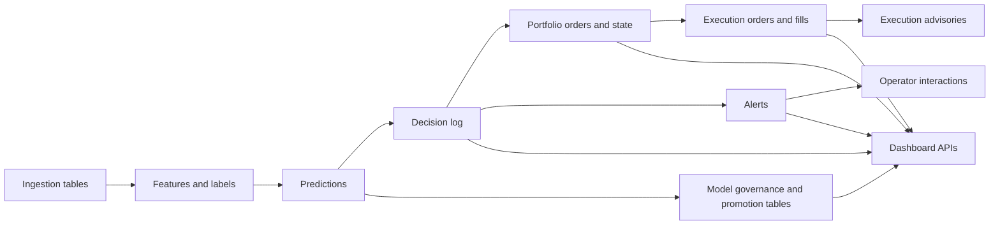

# Trading System Database Map

This document explains the main runtime database/storage contract used by the repo in human terms.

Last verified against code: 2026-06-22

It is not meant to replace the schema in `engine/runtime/storage.py` or `engine/runtime/storage_pg.py`. It is meant to make the schema understandable.

Canonical: [Database_Schema.md](Database_Schema.md) is the authoritative, complete table register (kept in lockstep with `engine/runtime/schema/table_classification.py`). This map is a curated data-flow subset, not a complete register, and does not re-list every table.

If you want the short version:

- the database is the shared memory of the system
- ingestion writes market and external data into it
- strategy jobs read those data and write predictions and decisions
- portfolio and execution logic write actions and outcomes
- the dashboard reads summaries from the same store
- operator interactions, advisories, and governance snapshots now also live there

## 1. Where The Database Lives

The public storage facade is `engine/runtime/storage.py`. Current production-like storage is backed by `engine/runtime/storage_pg.py`; older SQLite-era file paths and constraints may still appear in tests, compatibility helpers, repair helpers, and historical docs.

Runtime connection targets come from `TS_PG_DSN` or platform defaults. `DB_PATH` now means "local data root / legacy identity path" for diagnostics, artifacts, and test backends. In supervised or production-like modes it must be an absolute directory such as `/var/lib/trading`; relative values fail runtime config and production preflight. File-shaped legacy values are tolerated by `db_guard.resolve_db_path()` and normalized to their parent directory only after the raw path has passed the absolute-path gate.

For the Docker Timescale/Postgres deployment, database tuning comes from the
`TIMESCALE_*` variables in `deploy/compose/.env`. The compose service passes
those values directly to Postgres, and production preflight records a
`postgres_tuning` diagnostic with the configured values, container-memory
derivation, bounded memory estimate, WAL retention budget, and reachable
`pg_settings` values. `PREFLIGHT_REQUIRE_DOCKER_POSTGRES_TUNING=1` makes this a
hard gate for the compose production path.

For compose production, intended settings are not enough. Keep
`PREFLIGHT_REQUIRE_DOCKER_RUNTIME_EVIDENCE=1` and refresh
`/var/backups/trading/evidence/postgres_pg_settings.json` from the running
Timescale container after restarts or tuning changes. The same preflight run also
uses Docker inspect and Redis `CONFIG GET` evidence under
`/var/backups/trading/evidence/` to prove the running Timescale container has the
expected memory/memswap/`/dev/shm` limit, Docker log caps, port bindings, and
mounts, and that Redis effective `maxmemory` still matches the configured
container budget.

In older local SQLite-oriented setups, and in the isolated SQLite test backend, the main file was usually:

- `data/trading.db`

New local defaults write compatibility SQLite files under `var/db/`, for
example `var/db/trading.db`. Existing explicit `DB_PATH` values are still
honored.

Do not infer that new schema work is local-file-only. Treat the runtime storage facade and Postgres migrations as the primary persistence layer, and add migrations/tests for any schema or write-path change.

Postgres durability defaults to the server/session setting for every write.
`TRADING_REFETCHABLE_PG_DURABILITY_TIER` accepts only `default` and `relaxed`;
empty/unset behaves as `default`, and invalid values fail production preflight
and the write-surface configuration path. `relaxed` is the only supported opt-in
for `SET LOCAL synchronous_commit = off`. The central production allowlist lives
in `engine.runtime.pg_durability`, and the helper refuses unknown or protected
tables/scopes instead of trusting call-site strings.

| Write surface | Durability class |
| --- | --- |
| `engine.runtime.storage_pg_prices.PostgresPriceStorage.write_batch` for `price_ticks`, `price_quotes`, and `price_quotes_raw` | Refetchable price data; may use relaxed durability when the env tier is `relaxed` |
| `engine.runtime.telemetry_append_buffer` durable-spools and flushes `price_quotes_raw`, `price_provider_health`, `weather_provider_health`, `ingestion_pipeline_health`, and `ingest_slippage` | Refetchable ingestion telemetry; accepted rows go to a bounded SQLite WAL spool first, then delete only after the Postgres/SQLite write transaction commits; may use relaxed durability when the env tier is `relaxed` |
| Timescale queue flushes for `price_data`, `runtime_metrics`, `data_source_logs`, `price_provider_health`, `weather_provider_health`, and `ingestion_pipeline_health` | Refetchable price/market-data/telemetry; may use relaxed durability when the env tier is `relaxed` |
| Normal `engine.runtime.storage.run_write_txn` writes, schema/migration writes, order/broker/ledger/risk/capital/audit/event-log/model/trade-outcome writes, and any unclassified Postgres write | Default Postgres durability; never receives `SET LOCAL synchronous_commit = off` |

The active tier and allowlists are visible in runtime snapshots under
`durability` for the Postgres price sidecar, Timescale client, and telemetry
append buffer, and in production preflight JSON under
`refetchable_pg_durability`. A relaxed snapshot should show `tier=relaxed` and
`relaxed=true`; that only means the approved refetchable surfaces can relax
durability, not that protected financial/control writes can opt in. Protected
table names such as `execution_orders`, `broker_order_state`,
`trade_attribution_ledger`, `risk_state`, `equity_history`, `event_log`,
`model_registry`, and `trade_outcomes` are rejected by the durability helper if
a relaxed-durability scope attempts to include them.

The Postgres price sidecar's normal write path is binary `COPY` into fixed
unlogged staging tables created by `ensure_schema()`, followed by one
`INSERT ... SELECT DISTINCT ON (...) ... ON CONFLICT DO UPDATE` per target
(`price_ticks`, `price_quotes`, and `price_quotes_raw`). Duplicate keys inside a
flush resolve by the original row order's descending staging ordinal, so retries
and duplicate events are deterministic. If psycopg binary COPY is unavailable,
the sidecar records the fallback in its snapshot and uses bounded multi-row
VALUES upserts; operators can disable COPY or disable that fallback with the
`TIMESCALE_PRICES_COPY_*` settings.

Before either write path runs, `PostgresPriceStorage.write_batch` normalizes each
input mapping through a cached row object. Symbol parsing, timestamp-to-datetime
conversion, numeric coercion, provider/source text selection, and raw-event key
normalization are computed once per input mapping and then reused by the
`price_ticks`, `price_quotes`, and `price_quotes_raw` row builders. The
`storage_pg_prices` snapshot exposes cumulative normalization counters
(`normalization_safe_float_calls`, `normalization_safe_int_calls`,
`normalization_datetime_conversions`, `normalization_symbol_parses`, and
`normalization_event_key_normalizations`) so operators can verify conversion work
per batch without inspecting tests.

Raw price events use producer-side `price_raw:v1` event keys computed from stable
provider, symbol, event type, upstream identifiers, and event timestamps. Mutable
market floats (`last`, `bid`, `ask`, `volume`, spreads, and sizes) are excluded
from key generation. SQLite direct writes, telemetry-buffer flushes, the
Postgres price sidecar VALUES path, and the Postgres/Timescale COPY staging path
all upsert `price_quotes_raw` on `(symbol, provider, event_key, ts_ms)` (or
`"time"` in the sidecar table) so retries and SQLite-to-Timescale cutover use the
same raw-event identity.

The asyncpg Timescale sidecar uses the same staging/upsert shape for eligible
append-heavy hypertables. It prepares deterministic session temp staging tables
once per pooled connection, loads flushes through `copy_records_to_table()`,
deduplicates intra-flush conflict keys with `DISTINCT ON (...), _ordinal DESC`,
and records COPY, fallback, and dedupe counters in the Timescale health
snapshot. Unsupported tables such as `model_registry`, or connections without
COPY support, stay on the direct upsert fallback when
`TIMESCALE_COPY_STAGING_FALLBACK_ENABLED=1`.

Timescale chunk intervals come from
`engine/runtime/schema/table_classification.py`. Tick/quote, price-bar, and
health-metric hypertables use daily chunks; feature, decision, audit, and
execution history defaults stay weekly unless their classification says
otherwise. Fresh schema creation passes that interval to `create_hypertable`;
startup/migrations rerun the classified hypertable creation path and call
`set_chunk_time_interval` so existing deployments converge. Compression setup is
also rerun idempotently: every compressed hypertable uses
`timescaledb.compress_orderby = '<real time column> DESC'` while keeping its
existing segment key policy. The main schema uses each table classification's
`time_column`; the Postgres price sidecar orders by its real `"time"` columns;
the asyncpg Timescale sidecar orders price/feature/model/trade hypertables by
`"timestamp"` and operational telemetry hypertables by `"time"`. Price and
Timescale sidecar snapshots expose desired and actual
read-back values under `policy_status.chunk_intervals`, and runtime metrics emit
`storage_pg_prices_hypertable_chunk_interval_ms` or
`timescale_hypertable_chunk_interval_ms` gauges per table. Compatibility tables
created after numbered migrations, such as `labels_price`, also call the
classified hypertable helper when created.

Production soak acceptance must verify that those policies are applied in the
running Timescale catalog. `engine.runtime.ingestion_soak` builds the read-only
`/api/health.ingestion_soak.timescale_policy` report from
`timescaledb_information.hypertables`, `timescaledb_information.dimensions`,
`timescaledb_information.jobs`, and `pg_indexes`. Production preflight treats
missing hypertables, missing dimensions, chunk-interval drift, missing
compression jobs, and missing scoring indexes such as
`idx_tracked_predictions_prediction_id_ts_id`,
`idx_model_performance_prediction_id`, and
`ux_model_performance_tracked_prediction_id` as applied-policy failures. This
is separate from migration configuration: a migration existing in the repo is
not GO evidence until the catalog report is clean.

Cold boot and migration ownership:

- `bootstrap_first_run()`, `repair_schema()`, and `storage.init_db()` own boot-time schema creation and repair.
- durable schema changes belong under `engine/runtime/schema/migrations/`
- `get_db_validation_snapshot(strict=True)` is the runtime contract check used by production preflight and startup gates
- when Postgres cannot be acquired or validation fails, the runtime should remain degraded or blocked rather than falling back to SQLite

Test storage requirements:

- pytest defaults set `TS_TESTING=1`, `TS_STORAGE_BACKEND=sqlite`, and a temp `DB_PATH`
- tests that intentionally exercise real Postgres should use the `requires_postgres` marker and a reachable `TS_PG_DSN`
- SQLite-specific tests are compatibility and contention-regression tests, not proof that production storage is available

## 2. How To Think About The Schema

The easiest way to understand the schema is as a set of table families.

| Table Family | What it stores |
| --- | --- |
| Runtime and control | health, metadata, jobs, locks, audit state |
| Market and ingestion | prices, quotes, options, provider health, raw event data |
| Features and labels | model inputs, derived features, structured document events, target labels |
| Models and governance | model registry, promotion audit, drift, governance snapshots |
| Decisions and alerts | system decisions, alerts, acknowledgements, operator interactions |
| Portfolio and risk | target weights, equity, risk snapshots, suppression state |
| Execution | orders, fills, execution policy audits, execution health |
| Dashboard and operator | decision views, interaction logs, advisory actions |
| Research and evaluation | backtests, walk-forward runs, validation scores, stress outputs |

## 3. Main Data Flow

## 4. Core Tables You Should Understand First

If you only learn ten tables, learn these first.

| Table | What it means |
| --- | --- |
| `prices` | simple market price history by symbol and timestamp |
| `events` | external or derived event records |
| `structured_document_events` | timestamped filing/transcript/news event extractions with source document id, availability timestamp, confidence, and PIT metadata |
| `predictions` | model output by symbol and horizon |
| `decision_log` | the system's recorded trading decisions and explanations |
| `alerts` | alert records emitted by rules or policy surfaces |
| `portfolio_state` | current target or held portfolio state by symbol |
| `portfolio_orders` | intended portfolio transitions |
| `execution_orders` | order submissions and broker-facing metadata |
| `execution_fills` | realized execution outcomes |
| `runtime_meta` | small shared key/value runtime state |

## 5. Table Families

### Runtime And Control Tables

These tables support orchestration rather than trading logic directly.

| Table | Role |
| --- | --- |
| `runtime_meta` | small key/value state used across the runtime |
| `job_history` | start/stop/error history for jobs |
| `job_locks` | coordination for jobs that must not overlap; the `ingestion_restart_guard/v1::` row prefix is reserved for expiring ingestion child restart-storm accounting |
| `job_heartbeats` | liveness data from running jobs |
| `job_checkpoints` | progress checkpoints for resumable or tracked jobs |
| `event_log` | structured runtime event stream |
| `event_log_state` | event-log cursor/state tracking |
| `runtime_metrics` | general metric points for system visibility, including `postgres.wal.alert_state` from continuous WAL/storage alert evaluation |
| `schema_version` | schema version bookkeeping |

### Market And Ingestion Tables

These tables hold raw or near-raw market and provider inputs.

For the live-ingestion family, schema ownership lives in `engine/runtime/storage.py`.
`init_db()` and its storage-owned repair helpers create and migrate `prices`, `price_quotes`,
`price_quotes_raw`, `price_provider_health`, `ingestion_pipeline_health`,
`price_feed_lock`, and `options_symbol_ingestion_state`; `poll_prices.py` and
`options_poll.py` should only read or write rows against those tables.
`options_poll.py` bulk-loads `options_symbol_ingestion_state` once per run
(the default 600-symbol cycle fits in one state query), fetches provider HTTP
snapshots in bounded waves (`OPTIONS_POLL_FETCH_CONCURRENCY`), and keeps chain,
event, and state writes on the single writer connection. High-volume
`options_chain` and `options_chain_v2` rows plus symbol-state updates are staged
in memory until the batch boundary. On Postgres connections with psycopg COPY
support, option rows flush through temporary COPY staging tables and deterministic
`INSERT ... SELECT DISTINCT ON (...) ... ON CONFLICT` upserts; SQLite, tests, or
adapters without COPY fall back to bulk `executemany`. Symbol-state rows flush as
one bulk `executemany` batch before commit. Commits are clamped to 25 to 50 symbols per batch
(`OPTIONS_POLL_COMMIT_BATCH_SYMBOLS`; legacy `OPTIONS_POLL_COMMIT_EVERY_SYMBOLS`
is an alias). State-only transient write failures are recorded through
`state_write_failures` and do not force per-symbol commits. Provider cooldown,
disable, and cached-fallback state remains in `options_symbol_ingestion_state`
and provider health telemetry. Each cycle records
batching metadata in `ingestion_pipeline_health` under `options_poll`, including
state-load query count, fetch symbols/max workers, commit batches, max symbols per
commit, option rows written, state rows written, cached fallback symbols, bulk-write
failures, and state-write failures.
Repository validation now also blocks new DDL for that owned family outside the
approved owner modules, and runtime validation treats unexpected columns, primary-key
drift, or missing owned indexes on those tables as contract failures.
For Postgres, the same validation also reads `schema_migrations`, required table
columns, required indexes, and owned-table column types from the live catalog;
production preflight fails closed when any expected migration ID or required
owned schema element is missing.

| Table | Role |
| --- | --- |
| `prices` | simple price points |
| `price_quotes` | top-of-book or quote-like market state; SQLite uses `ts_ms`, while canonical Timescale sidecars use `"time"` and project API `ts_ms` at read time |
| `price_quotes_raw` | provider-specific raw quote captures keyed by `(symbol, provider, event_key, ts_ms)` on SQLite and `(symbol, provider, event_key, "time")` on Timescale; producer `price_raw:v1` keys exclude mutable floats |
| `price_feed_lock` | single-writer coordination row for the canonical polling price feed path |
| `price_bars` | aggregated time-bucketed bar data |
| `price_provider_health` | buffered provider freshness and health state; non-authoritative telemetry alongside canonical `prices` inputs |
| `ingestion_pipeline_health` | per-pipeline liveness and ingest-volume snapshots for startup checks and operator diagnostics |
| `options_symbol_ingestion_state` | options-ingestion retry, cooldown, and fallback state per underlying symbol |
| `market_microstructure_signals` | spread, liquidity, top-of-book depth, order-book imbalance, and microstructure-derived signals used by execution realism and shadow LOB readiness |
| `options_chain`, `options_chain_v2` | option chain snapshots |
| `options_surface`, `options_surface_agg` | derived options surface data |
| `options_symbol_features`, `options_event_features` | symbol-linked options summaries and event-linked options signals derived from chain snapshots |
| `events` | canonical normalized non-price event layer across news, social, filings, earnings, weather, and macro-style signals |
| `earnings_calendar` | earnings source table feeding normalized `events` |
| `sec_filings` | filings source table feeding normalized `events` |
| `social_posts`, `social_features`, `social_regimes` | social-source raw and derived features; raw social events are also normalized into `events` |
| `weather_forecast_region_daily`, `weather_alerts`, `weather_provider_health` | weather source tables and provider state; alert/forecast events are also normalized into `events` |
| `gdelt_macro_features` | macro/event-style derived features built from normalized news/macro events |

### Features, Labels, And Prediction Tables

These tables sit between raw data and trade decisions.

| Table | Role |
| --- | --- |
| `market_features` | feature rows derived from market data |
| `labels` | training labels for strategy/model training |
| `labels_exec` | execution-specific gross/net labels used by evaluation and training loaders |
| `net_after_cost_labels` | timestamp-safe model-intent-to-execution label artifact with gross return, costs, net return, model family, regime, and confidence metadata |
| `learned_alpha_decay_runs` | training-run metadata for learned alpha decay, capacity, and crowding estimates |
| `learned_alpha_decay_estimates` | latest learned half-life, max useful age, capacity, crowding, and size/block policy by cohort |
| `learned_alpha_decay_age_edges` | realized net edge by signal-age bucket for learned-alpha cohorts |
| `predictions` | model predictions used by downstream logic |
| `temporal_predictions` | temporal-model outputs |
| `event_embeddings` | stored embedding vectors or references for event content |
| `event_embeddings_seq` | sequence bookkeeping for embeddings |

`labels_price` rows created by the sqlite-oriented price-label backfill may include `meta_json.fx_clock_corrected=true` and `meta_json.naive_eval_ms` when an FX label used the canonical `engine/data/prices/fx_clock.py` evaluation timestamp instead of the naive wall-clock horizon. This is a sqlite-side audit enrichment only; the Postgres compatibility table records the corrected `ts_eval_ms` but does not have a JSON metadata column.
| `factor_features` | factor-style features |
| `factor_observations` | raw factor observations |
| `factor_group_scores` | grouped factor scoring |
| `tsfresh_feature_snapshots` | persisted tsfresh feature snapshots for train/serve reuse |
| `feature_candidates`, `feature_evaluation`, `feature_registry` | discovered feature candidates, evaluation decisions, and accepted discovery metadata |

### Models, Drift, And Governance Tables

These tables answer:

- what models exist
- which model is active
- whether promotion was allowed
- whether drift or governance issues are showing up

| Table | Role |
| --- | --- |
| `model_registry` | canonical registry of models |
| `champion_assignments` | active champion selections; production writes are owned by `engine.strategy.model_competition.repository` |
| `model_marketplace_scores` | model ranking or marketplace-style scoring; production writes are owned by `engine.strategy.model_competition.repository` |
| `model_competition_rankings` | realized competition rankings; candidates without net-after-cost label evidence are excluded |
| `model_promotion_audit` | promotion and rollback-style audit trail |
| `model_promotion_cooldown` | cooldown gates after promotion activity |
| `model_post_promo_watch` | models under watch after promotion |
| `model_post_promo_results` | watch results after promotion |
| `model_promotion_guard` | promotion guard state |
| `model_governance_log` | governance snapshots and summary payloads |
| `model_drift` | model drift data |
| `feature_distribution_drift` | feature distribution drift |
| `production_monitoring_metrics` | latest production drift, calibration, shadow-vs-live, and net-PnL monitoring metrics; alerts create signal-only `drift_retrain_events` |
| `residual_distribution_drift` | residual drift |
| `self_critic_alerts` | model self-critic warning records |
| `shadow_predictions`, `shadow_metrics`, `shadow_training_runs` | shadow-model evaluation path |
| `challenger_shadow_orders` | challenger shadow trading decisions or outcomes |
| `hypothesis_registry` | legacy-compatible statistical promotion evidence |
| `promotion_statistical_evidence` | current promotion-gate evidence for BH-FDR, Reality Check, pool, MPC, and era robustness payloads |
| `strategy_promotion_candidates` | governed shadow-strategy promotion candidates and operator approval state; live mutation still requires realized PnL, replay/OPE/statistical evidence, cooldown, and audit records |
| `experiment_ledger` | append-only generated-candidate ledger for lineage, trial budgets, false-discovery evidence, redundancy checks, and promotion decisions |

### Decisions And Alerts Tables

These tables are closest to the "thinking" and "warning" surfaces of the system.

| Table | Role |
| --- | --- |
| `decision_log` | recorded decisions, explanations, and feature context |
| `alerts` | alert records shown to operators or consumed by policies |
| `alert_acks` | acknowledgement actions |
| `alert_shelves` | temporary operator shelving state with expiry and required reason |
| `alert_lifecycle_events` | append-only alert acknowledgement/shelving/resolution event stream |
| `alert_resolutions` | alert closure or resolution records |
| `alert_interactions` | passive UI/operator interaction tracking |
| `decision_views` | decision detail view logging |
| `rules_audit` | audit records for rule-related changes or evaluations |
| `trade_decision_snapshot` | snapshot of decision context attached to trade logic |

### Portfolio And Risk Tables

These tables answer:

- what the portfolio currently is
- what it is trying to become
- what risks or suppressions are active

| Table | Role |
| --- | --- |
| `portfolio_state` | current portfolio exposure by symbol |
| `portfolio_orders` | intended portfolio changes |
| `portfolio_equity_state` | total portfolio equity history/state |
| `portfolio_risk_snapshots` | periodic portfolio risk snapshots |
| `portfolio_kill_snapshots` | kill-state portfolio snapshots |
| `risk_state` | compact current risk state |
| `risk_events` | risk incidents and warnings |
| `size_policy`, `size_policy_points` | sizing policy and its time series |
| `strategy_metrics` | strategy-level performance/health metrics |
| `strategy_allocations` | capital allocated by strategy |
| `strategy_allocator_scores` | allocator scoring inputs or outputs |
| `strategy_allocator_history` | allocator history |
| `strategy_cooldowns` | strategy-level cooldown state |
| `sleeve_metrics`, `sleeve_allocations`, `sleeve_registry` | sleeve-level capital and performance tracking |
| `shadow_capital_scores` | shadow allocation scoring |
| `trade_suppression_state`, `trade_suppression_audit` | suppression decisions and audit |
| `suppression_opportunity` | possible suppression events/opportunities |

### Execution Tables

These tables track order handling and realized market interaction.

| Table | Role |
| --- | --- |
| `execution_orders` | execution intent and broker submission record |
| `execution_fills` | realized fills and slippage/latency |
| `exec_open_orders` | current open order state |
| `exec_order_events` | order lifecycle events |
| `execution_policy_audit` | policy shaping or gating audit |
| `execution_mode` | current execution mode state |
| `execution_mode_audit` | changes to execution mode |
| `execution_health_state` | summary execution health |
| `execution_alerts` | execution-specific alerting |
| `execution_order_idempotency` | durable live broker duplicate-protection and order lifecycle safety |
| `terminal_intent_rejections` | terminal order/flatten pre-trade rejection audit rows |
| `execution_divergence` | divergence between expected and actual execution state |
| `broker_fills` | broker-specific fill records |
| `broker_order_state` | broker order snapshots |
| `broker_connection_health` | broker health and connectivity state |
| `broker_account`, `broker_positions`, `broker_meta` | broker-facing account and position snapshots |
| `broker_config_audit` | broker configuration update, activation, and connection-test audit rows |

### Operator And Advisory Tables

These tables support operator-facing observability and advisory workflows in the current schema.

| Table | Role |
| --- | --- |
| `alert_interactions` | logs alert and decision UI interactions |
| `decision_views` | tracks decision detail opens |
| `execution_ai_advisory` | non-authoritative execution advice records |
| `execution_ai_advisory_actions` | operator approval/rejection audit for advisories |
| `model_governance_log` | dashboard-facing governance summary snapshots |
| `broker_config_audit` | broker configuration and connection-test audit trail |
| `terminal_intent_rejections` | terminal pre-trade rejection evidence |

### Research And Evaluation Tables

These tables support offline analysis more than live control.

| Table | Role |
| --- | --- |
| `backtest_scores` | backtest outputs |
| `walk_forward_runs`, `walk_forward_scores` | walk-forward evaluation |
| `backtest_cpcv_runs`, `backtest_cpcv_paths` | CPCV/PBO, cost-adjusted, and gated-backtest evidence |
| `validation_scores` | validation results |
| `model_metrics` | model performance summaries |
| `embed_model_eval`, `embed_conf_calib` | embedding/evaluation calibration tables |
| `temporal_model_eval` | evaluation for temporal models |
| `causal_scores`, `causal_dags` | causal diagnostics and curated DAG definitions |

## 6. Important Table Shapes

Below are the most important tables in simplified column form.

### `decision_log`

This is the main "why did the system decide that?" table.

| Column | Meaning |
| --- | --- |
| `id` | decision identifier |
| `ts_ms` | time of decision |
| `event_id` | upstream event linkage if any |
| `symbol` | asset or symbol |
| `horizon_s` | decision horizon |
| `predicted_z` | prediction magnitude |
| `confidence` | confidence estimate |
| `model_name` | originating model |
| `model_kind` | model family/kind |
| `model_version` | artifact version, registry version, or equivalent model identifier |
| `feature_set_tag` | persisted feature-schema tag used for train/serve auditability |
| `components_json`, `component_vector` | nullable ensemble component payloads for blended decisions |
| `features_json` | feature payload |
| `explain_json` | explanation payload |
| `extra_json` | extra context |

### `alerts`

This is the main warning/attention table for operators and policy layers.

| Column | Meaning |
| --- | --- |
| `id` | alert identifier |
| `ts_ms` | alert time |
| `symbol` | affected symbol |
| `severity` | alert severity |
| `rule_id` | originating rule |
| `prediction_id` | typed upstream prediction linkage for the covered trade chain |
| `expected_z` | expected move estimate if relevant |
| `confidence` | confidence estimate if relevant |
| `title`, `message` | human-readable alert text |
| `status` | lifecycle state |
| `detail_json` | detailed payload |

### `alert_acks`, `alert_shelves`, and `alert_lifecycle_events`

These tables record operator alert lifecycle actions without treating the alert row itself as the only source of lifecycle truth.

| Table | Column | Meaning |
| --- | --- | --- |
| `alert_acks` | `alert_id` | acknowledged alert id |
| `alert_acks` | `acked_ts_ms`, `acked_by`, `source` | who acknowledged the alert and when |
| `alert_acks` | `expires_ts_ms`, `reason` | acknowledgement expiry and optional operator reason |
| `alert_shelves` | `alert_id` | shelved alert id |
| `alert_shelves` | `shelved_ts_ms`, `expires_ts_ms` | shelving interval |
| `alert_shelves` | `shelved_by`, `reason`, `source`, `severity` | shelving actor, required reason, source, and alert severity context |
| `alert_shelves` | `detail_json` | structured shelving metadata |
| `alert_lifecycle_events` | `alert_id`, `ts_ms`, `lifecycle_state` | append-only lifecycle event |
| `alert_lifecycle_events` | `actor`, `reason`, `source`, `detail_json` | operator/source context for the lifecycle action |

### `portfolio_state`

This is the compact current portfolio state by symbol.

| Column | Meaning |
| --- | --- |
| `symbol` | symbol |
| `side` | long/short/flat style side |
| `weight` | current target or held weight |
| `opened_ts_ms` | original open time |
| `updated_ts_ms` | last update time |
| `source_alert_id` | upstream alert linkage |
| `explain_json` | explanation payload |

### `portfolio_orders`

This table records intended changes to the portfolio.

For the covered trading chain, `source_alert_id` and `prediction_id` are typed lineage columns backed by storage-level constraints where available. JSON remains audit context only.

| Column | Meaning |
| --- | --- |
| `id` | order/change identifier |
| `ts_ms` | creation time |
| `symbol` | symbol |
| `action` | increase, reduce, flip, close, and similar |
| `from_weight` | previous weight |
| `to_weight` | new target weight |
| `delta_weight` | change size |
| `source_alert_id` | upstream alert linkage |
| `prediction_id` | upstream prediction linkage for the covered trade chain |
| `explain_json` | why the change was requested |

### `execution_orders`

This is the execution-intent table.

For the covered trading chain, `portfolio_orders_id`, `source_alert_id`, and `prediction_id` are enforced typed lineage columns. `extra_json` should mirror that lineage, not define it.

| Column | Meaning |
| --- | --- |
| `client_order_id` | client-facing order id |
| `broker` | broker destination |
| `portfolio_orders_id` | upstream portfolio order linkage |
| `source_alert_id` | upstream alert linkage |
| `prediction_id` | upstream prediction linkage |
| `symbol` | symbol |
| `qty` | submitted quantity |
| `submit_ts_ms` | submit timestamp |
| `expected_px` | expected execution price |
| `mid_px`, `bid_px`, `ask_px` | market reference prices |
| `spread_bps` | spread estimate |
| `status` | lifecycle status |
| `extra_json` | extra execution context |

### `execution_fills`

This is the realized execution-outcome table.

For the covered trading chain, `portfolio_orders_id`, `source_alert_id`, and `prediction_id` are enforced typed lineage columns. `raw_json` and `extra_json` remain secondary audit context.

| Column | Meaning |
| --- | --- |
| `client_order_id` | order linkage |
| `fill_id` | broker fill id |
| `portfolio_orders_id` | upstream portfolio order linkage |
| `source_alert_id` | upstream alert linkage |
| `prediction_id` | upstream prediction linkage |
| `symbol` | symbol |
| `fill_ts_ms` | fill time |
| `fill_qty` | filled quantity |
| `fill_px` | fill price |
| `expected_px` | expected price |
| `slippage_bps` | realized slippage |
| `fill_latency_ms` | latency to fill |
| `fees`, `commission` | execution cost |
| `raw_json`, `extra_json` | extra broker/context payload; secondary audit context, not the primary lineage contract |

### `model_performance` Scoring Indexes

`engine/model_scoring.py` scores unresolved `predictions` and `tracked_predictions` into `model_performance`. Production migration `0063_model_scoring_indexes.py` keeps that path bounded with:

| Index | Purpose |
| --- | --- |
| `idx_tracked_predictions_prediction_id_ts_id` | non-null partial index supporting the `LEFT JOIN LATERAL` latest-tracking lookup by `(prediction_id, ts_ms DESC, id DESC)` without a sort |
| `idx_model_performance_prediction_id` | non-null partial index supporting the unresolved-prediction anti-probe so already scored predictions are skipped cheaply |
| `ux_model_performance_tracked_prediction_id` | backs `ON CONFLICT(tracked_prediction_id)` so scoring retries update the existing row instead of inserting duplicates |

### `net_after_cost_labels`

This is the durable model-intent-to-realized-label artifact used by training, OOS evaluation, model marketplace scoring, and promotion gates.

Rows are timestamp-safe: `label_ts_ms` is the original prediction timestamp, `exit_ts_ms` is the observed exit/fill timestamp, and `computed_at_ts_ms` is when the artifact was materialized. Promotion requires realized net-cost evidence; gross-only performance does not promote a model.

| Column | Meaning |
| --- | --- |
| `event_id`, `prediction_id`, `source_alert_id` | prediction, alert, and execution lineage |
| `symbol`, `horizon_s`, `label_ts_ms` | label key and original prediction time |
| `entry_ts_ms`, `exit_ts_ms`, `computed_at_ts_ms` | entry, exit, and computation times |
| `model_name`, `model_id`, `model_version`, `model_family` | model identity used for training/evaluation grouping |
| `regime` | regime metadata attached to model intent |
| `confidence`, `confidence_raw`, `confidence_metadata_json` | confidence and prediction score metadata |
| `side`, `realized` | signed direction and whether real fills back the row |
| `gross_return`, `realized_forward_return`, `execution_cost_return`, `net_return` | gross, raw forward, cost drag, and net returns |
| `fees_bps`, `slippage_bps`, `spread_bps`, `borrow_bps`, `financing_bps`, `total_cost_bps` | execution and carry cost decomposition |
| `order_count`, `fill_count` | linked execution evidence counts |
| `label_metadata_json` | timestamp-safety, execution trace, carry availability, and source details |

### `learned_alpha_decay_*`

`engine/strategy/jobs/train_learned_alpha_decay.py` learns realized edge curves from `net_after_cost_labels` and falls back to `labels_exec` only when realized net-after-cost labels are absent. It writes:

| Table | Meaning |
| --- | --- |
| `learned_alpha_decay_runs` | run timestamp, lookback, age bucket, and estimator parameters |
| `learned_alpha_decay_estimates` | cohort-level learned half-life, max useful age, capacity estimate, crowding penalty, size multiplier, and block flag |
| `learned_alpha_decay_age_edges` | per-age-bucket realized edge rows used to audit the estimate |

Production enforcement:

- execution policy uses the estimates to shorten TTL/half-life, block stale or low-capacity risk-increasing orders, and size crowded cohorts down
- portfolio execution intents apply the size multiplier before model/group/portfolio caps
- position sizing can consume the same estimate object for direct sizing calls
- champion evaluation treats learned low-capacity/crowded cohorts as candidate/current blockers

### `execution_ai_advisory`

This is an operator-facing advisory table.

| Column | Meaning |
| --- | --- |
| `id` | advisory id |
| `ts_ms` | advisory time |
| `portfolio_orders_id` | upstream portfolio order linkage |
| `broker` | broker context |
| `symbol` | symbol |
| `side` | side |
| `aggressiveness` | suggested aggressiveness |
| `urgency` | suggested urgency |
| `recommendation` | short recommendation |
| `expected_slippage_bps` | estimated slippage |
| `confidence` | confidence in advice |
| `approved`, `rejected` | operator action flags |
| `rationale` | explanation text |
| `features_json` | feature evidence |
| `advisory_json` | full structured advisory payload |

### `broker_meta` and `broker_config_audit`

The broker configuration API stores current broker settings in `broker_meta` and records operator-visible history in `broker_config_audit`.

| Table | Column | Meaning |
| --- | --- | --- |
| `broker_meta` | `key` | config key such as `broker.config`, `broker.credentials_enc`, `broker.credentials_key_version`, or `broker.last_test` |
| `broker_meta` | `value` | JSON or encrypted credential blob |
| `broker_meta` | `updated_ts_ms` | last update time |
| `broker_config_audit` | `ts_ms`, `action`, `actor` | audit timestamp, action, and operator/source actor |
| `broker_config_audit` | `active_broker`, `success`, `message` | broker context and result |
| `broker_config_audit` | `detail_json` | structured details with credentials omitted or encrypted before storage |

### `terminal_intent_rejections`

This table records terminal order-entry requests that fail backend pre-trade controls before any `portfolio_orders` intent is written.

| Column | Meaning |
| --- | --- |
| `id` | rejection row id |
| `ts_ms` | rejection time |
| `symbol`, `side`, `qty` | requested terminal intent |
| `reason_code` | stable rejection code such as `missing_price`, `stale_price`, `max_qty_exceeded`, `max_notional_exceeded`, or `duplicate_recent_order` |
| `reason` | operator-facing rejection message |
| `source` | source surface, currently `terminal` |
| `detail_json` | price, cap, duplicate-window, or gate detail |

### `model_governance_log`

This is the current dashboard-facing governance summary table.

| Column | Meaning |
| --- | --- |
| `id` | row id |
| `ts_ms` | snapshot time |
| `source` | governance source |
| `regime` | regime context |
| `champion_name` | active champion |
| `challenger_name` | active challenger |
| `status` | summary status |
| `summary_json` | detailed summary payload |

## 7. Operator Observability And Advisory Tables

The following tables are the operator-observability and advisory tables that matter most when tracing UI interactions or advisory workflows:

| Table | Why it was added |
| --- | --- |
| `alert_interactions` | to learn how operators engage with alerts and decisions |
| `decision_views` | to measure decision-detail usage |
| `execution_ai_advisory` | to persist advisory-only execution guidance |
| `execution_ai_advisory_actions` | to audit operator approval/rejection |
| `model_governance_log` | to expose governance snapshots to the dashboard |

These tables are additive. They improve visibility and analytics without replacing the existing runtime architecture.

## 8. Questions The Database Can Answer

### Data and market questions

- What prices do we have for a symbol?
- Which providers are stale or unhealthy?
- Is the live poller holding the feed lock, and which ingestion pipelines are still reporting healthy writes?
- What option surface or microstructure context existed at a given time?

### Strategy questions

- What did the model predict?
- Which features were used?
- What decision was recorded?
- What explanation was stored?

### Risk and portfolio questions

- What was the portfolio state at a given time?
- What weight change was requested?
- Was trade suppression active?
- Were concentration or shadow-capital constraints showing up?

### Execution questions

- What order was sent?
- What happened at the broker?
- What slippage and latency were realized?
- What advice did the execution sidecar produce?

### Oversight questions

- What alerts fired?
- Which alerts were acknowledged or resolved?
- What did the operator open or ignore?
- What governance state was active at the time?

## 9. Safe Rules For Editing Schema

If you change the schema, keep these rules:

1. make schema changes in `engine/runtime/storage.py`; for the live-ingestion family that means `prices`, `price_quotes`, `price_quotes_raw`, `price_provider_health`, `ingestion_pipeline_health`, `price_feed_lock`, and `options_symbol_ingestion_state`
   The poller/runtime call sites for that family should not carry their own `CREATE TABLE` or `ALTER TABLE` logic.
   The only legacy exception kept for compatibility is the bootstrap `prices` seed in `engine/runtime/jobs/repair_schema.py`; new owned-table DDL should not be added outside those owner modules.
2. prefer additive changes over destructive changes
3. add indexes with the table change, not later as an afterthought
4. avoid changing hot-path tables casually
5. keep dashboard-only analytics tables separate from execution-authoritative tables
6. preserve backward compatibility where possible

## 10. Current Table Register

Do not use a local `data/trading.db` or `var/db/trading.db` snapshot as a production schema catalog. The current table register is maintained in:

- [Database_Schema.md](Database_Schema.md)
- [engine/runtime/schema/table_classification.py](../engine/runtime/schema/table_classification.py)
- the migration files under [engine/runtime/schema/migrations/](../engine/runtime/schema/migrations)

When a table is added, update the migration, table classification, this database map when the table changes a documented family, and [DATA_CONTRACTS.md](DATA_CONTRACTS.md) when the table crosses module or operator boundaries.
