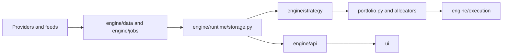

# Trading System Developer Map

This document explains where the code lives and how to navigate it.

Last verified against code: 2026-06-17

It is written for developers who need to answer:

- where should I look first?
- which file owns what?
- where do I add a new feature safely?
- which parts are critical infrastructure?

## 1. Directory Map

| Path | Purpose |
| --- | --- |
| `boot/` | local launcher and operator startup layer |
| `deploy/` | deployment and installation scripts |
| `engine/` | main Python application code |
| `engine/api/` | dashboard and operator API handlers |
| `engine/data/` | ingestion, providers, and raw data jobs |
| `engine/execution/` | broker routing, execution policy, order application |
| `engine/research/` | offline stress and fragility tooling |
| `engine/risk/` | risk-specific logic and utilities |
| `engine/runtime/` | storage, locks, job orchestration, health, lifecycle |
| `engine/strategy/` | features, labels, models, decisions, governance, portfolio logic |
| `ops/` | ad hoc operations scripts and utilities |
| `routes/` | focused route modules mounted by `dashboard_server.py` |
| `services/` | sidecar services and operator-adjacent integrations |
| `tools/` | developer tooling and smoke tests |
| `ui/` | browser dashboard assets |

## 2. Read Order

If you are new, read the code in this order:

1. `README.md`
2. `README_DATABASE_MAP.md`
3. `README_FUNCTION_MAP.md`
4. `README_SEQUENCE_DIAGRAMS.md`
5. `start_system.py`
6. `dashboard_server.py`
7. `engine/runtime/job_registry.py`
8. `engine/runtime/jobs_manager.py`
9. `engine/runtime/startup_orchestrator.py`
10. the subsystem you plan to modify

That gives you system flow before subsystem detail.

## 3. Core Files And What They Own

| File | Ownership |
| --- | --- |
| `start_system.py` | top-level Python runtime bootstrap and lifecycle |
| `dashboard_server.py` | HTTP boundary, dashboard serving, API wiring |
| `engine/runtime/storage.py` | public runtime storage facade and persistence helpers |
| `engine/runtime/storage_pg.py` | current Postgres-backed storage implementation |
| `engine/runtime/locks.py` | coordination and lock behavior |
| `engine/runtime/runtime_meta.py` | shared runtime metadata surface |
| `engine/runtime/job_registry.py` | canonical job registry |
| `engine/runtime/jobs_manager.py` | job launch/stop/status orchestration |
| `engine/runtime/startup_orchestrator.py` | startup sequencing |
| `engine/runtime/supervisor.py` | runtime supervision |
| `engine/runtime/live_trading_preflight.py` | fail-closed live deployment contract, confirmation, broker, backup-evidence, and arming-audit checks |
| `engine/runtime/live_execution_control.py` | shared emergency live-capital controls, `DISABLE_LIVE_EXECUTION`, and pre-live reconciliation policy |
| `engine/runtime/backup_evidence.py` | backup, WAL archive, and restore-drill freshness policy used by live preflight |
| `engine/model_registry.py` | canonical model registry and model feature contract lookup |
| `engine/strategy/model_intent.py` | canonical model-owned decision payload |
| `engine/strategy/feature_registry.py` | named feature resolver registry |
| `engine/strategy/feature_expansion.py` | schema-driven feature vector assembly |
| `engine/strategy/predictor.py` | live model resolution and inference contract |
| `engine/strategy/portfolio.py` | portfolio target and rebalance behavior |
| `boot/operator_server.js` | operator launcher, repair proxy, and guarded AI patch workflow |
| `services/operator_ai/agent.js` | bounded LLM diagnosis over support snapshots and watchdog context |
| `engine/execution/execution_policy_engine.py` | execution shaping and policy |
| `engine/execution/broker_router.py` | broker routing logic |
| `engine/execution/broker_failover_policy.py` | live broker identity, failover-chain validation, and non-retryable broker failure classification |
| `engine/execution/broker_submission_recovery.py` | fail-closed recovery marker for broker-accepted orders missing local durable submission state |
| `ui/dashboard.html` | main dashboard shell |
| `ui/dashboard.js` | main dashboard behavior |
| `services/data_source_manager.py` | DB-authoritative source catalog, credential storage contract, runtime env projection, and lifecycle reconciliation |
| `routes/data_sources_routes.py` | HTTP control-plane routes for the canonical source-management surface |
| `ui/data_sources.html` | single-page Data Sources Control Center for non-technical source setup and recovery |

## 4. Critical Infrastructure

These files are high-risk edit surfaces:

| File | Why it is sensitive |
| --- | --- |
| `engine/runtime/storage.py` | almost every subsystem depends on it |
| `engine/runtime/locks.py` | concurrency and coordination risk |
| `engine/runtime/job_registry.py` | startup and launch behavior depend on it |
| `start_system.py` | top-level lifecycle and boot ownership |
| `dashboard_server.py` | API/UI boundary and runtime wiring |
| `engine/strategy/portfolio.py` | direct effect on portfolio behavior |
| `engine/execution/execution_policy_engine.py` | direct effect on execution behavior |
| `engine/runtime/live_trading_preflight.py` | controls whether live mode can pass startup/preflight |
| `engine/runtime/live_execution_control.py` | emergency live-capital kill switch and pre-live reconciliation policy |
| `engine/execution/broker_failover_policy.py` | prevents unsafe live broker failover chains |
| `boot/operator_server.js` | operator controls, repair actions, and local patch workflow |

## 5. Where To Make Common Changes

### Add a new ingestion source

Look in:

- `engine/data/`
- `engine/jobs/`
- `engine/runtime/job_registry.py`
- `engine/runtime/storage.py` if new tables are needed
- `services/data_source_manager.py`
- `services/credential_encryption.py`
- `routes/data_sources_routes.py`
- `ui/data_sources.html`, `ui/data_sources.js`, and `ui/data_sources.css`

### Add a new dashboard read or panel

Look in:

- `engine/api/`
- `dashboard_server.py`
- `ui/dashboard.html`
- `ui/dashboard.js`
- a focused UI module in `ui/`

### Add a new model or strategy job

Look in:

- `engine/strategy/`
- `engine/strategy/jobs/`
- `engine/model_registry.py`
- `engine/runtime/job_registry.py`
- `engine/runtime/storage.py`
- `engine/strategy/promotion_guard.py`
- `engine/strategy/champion_manager.py`

If the model has its own feature contract, also look in:

- `engine/strategy/feature_registry.py`
- `engine/strategy/feature_expansion.py`
- the trainer for that model family
- `engine/strategy/models/lgbm_regressor.py`, `engine/strategy/models/xgb_regressor.py`, `engine/strategy/models/gbm_model.py`, or `engine/strategy/models/patchtst.py` for the current active model-family patterns
- `engine/strategy/ensemble/ridge_meta.py` for meta-ensemble behavior
- legacy/fallback paths such as `engine/strategy/embed_regressor.py` and `engine/strategy/temporal_predictor.py` only when maintaining those paths

### Change portfolio behavior

Look in:

- `engine/strategy/portfolio.py`
- `engine/strategy/model_intent.py`
- `engine/runtime/strategy_allocator.py`
- `engine/runtime/hierarchical_allocator.py`
- `engine/risk/`

### Change execution behavior

Look in:

- `engine/execution/execution_policy_engine.py`
- `engine/execution/broker_router.py`
- `engine/execution/broker_apply_orders.py`
- `engine/execution/broker_failover_policy.py`
- `engine/execution/broker_submission_recovery.py`
- `engine/execution/kill_switch.py`
- `engine/runtime/live_execution_control.py`
- `engine/runtime/live_trading_preflight.py`

### Change broker configuration or live activation

Look in:

- `engine/api/api_broker_config.py`
- `engine/execution/broker_failover_policy.py`
- `engine/runtime/live_trading_preflight.py`
- `engine/runtime/live_execution_control.py`
- `engine/runtime/schema/migrations/0053_broker_config_control_plane.py`
- `docs/openapi/openapi.yaml`
- `docs/PRODUCTION_CHECKLIST.md`
- `docs/REFERENCE_CONFIGURATION_GLOSSARY.md`

### Change alert lifecycle behavior

Look in:

- `engine/api/api_write.py`
- `engine/runtime/alerts.py`
- `engine/runtime/schema/migrations/0054_alert_lifecycle.py`
- dashboard alert UI modules under `ui/`

## 6. Main Runtime Data Path

## 7. API Layer Map

The API layer under `engine/api/` is the read/control boundary between runtime state and the browser/operator layer.

In practice it contains:

- read handlers
- operator handlers
- system and health endpoints
- HTTP parsing/transport helpers
- specialized dashboard read modules

### Newly integrated read/control surfaces

| API Surface | Purpose |
| --- | --- |
| decisions UI endpoints | recent decision list and detail drilldown |
| interaction logging endpoint | stores alert and decision interactions |
| human alignment summary endpoint | reports noisy or low-value alert patterns |
| execution advisory endpoints | lists advisories and stores operator actions |
| governance summary endpoint | reports promotion/safety state |
| broker config endpoints | reads, writes, tests, and audits broker configuration without editing `.env` |
| market/replay endpoints | serves OHLCV candle aggregation, server-sent market streams, and historical day replay payloads |
| terminal order endpoints | writes gated quantity/flatten intents and records pre-trade rejection reasons |

## 8. UI Layer Map

The UI is modular. The dashboard shell is central, and many feature areas live in smaller JS files.

| File | Purpose |
| --- | --- |
| `ui/dashboard.html` | main page layout |
| `ui/dashboard.js` | panel loading, event handling, modals |
| `ui/alerts_ui.js` | alert-focused interactions |
| `ui/operator_summary.js` | operator overview surfaces |
| `ui/telemetry_panel.js` | telemetry views |
| `ui/portfolio.js` | portfolio-specific rendering |
| `ui/data_sources.js` | data-source control-plane controller |
| `ui/runtime_diagnostics.js` | runtime diagnostics and pipeline-health detail rendering |
| `ui/execution_metrics.js` | execution analytics and cost/slippage rendering |
| `ui/portfolio_backtest.js` | latest backtest summary rendering |
| `ui/why_modal.js` | explanation-focused modal behavior |

### Standalone control-plane surfaces

| File | Purpose |
| --- | --- |
| `ui/data_sources.html` | canonical single-page source-management shell for provider/source CRUD, guided setup, tests, credential resets, and source logs |
| `routes/data_sources_routes.py` | HTTP surface for the data-source control plane |
| `engine/terminal/api/api_terminal.py` | read-mostly terminal endpoints |
| `engine/terminal/api/api_terminal_orders.py` | gated terminal order-entry endpoints |

For this functional area, do not add new operator-side `.env` feed-config flows. The source-management contract now lives in the data-source manager, its routes, and the standalone UI.

### Operator AI and repair surfaces

| File | Purpose |
| --- | --- |
| `boot/operator_server.js` | local operator HTTP server, guided repair proxy, and patch preview/apply/rollback boundary |
| `boot/operator_ui.html` | operator launcher and repair UI shell |
| `services/operator_ai/agent.js` | diagnostics-only strict-JSON analysis layer that consumes support snapshots and returns `action: null` |
| `engine/api/api_system.py` | support snapshot, watchdog, provider telemetry, and service-status payload builders |

## 9. Selected Integration Map

### What was added

| Area | Current file(s) |
| --- | --- |
| Decisions UI and interaction logging | `engine/runtime/storage.py`, `engine/api/api_read_advanced.py`, `engine/api/api_dashboard_reads.py`, `dashboard_server.py`, `ui/dashboard.html`, `ui/dashboard.js` |
| Human alignment analytics | `engine/runtime/storage.py`, `engine/api/api_ops.py`, `engine/api/api_ops_handlers.py`, `ui/alerts_ui.js`, `ui/dashboard.js` |
| Execution AI advisory | `engine/execution/execution_ai_advisor.py`, `engine/execution/broker_apply_orders.py`, `engine/runtime/storage.py`, `engine/api/api_ops.py`, `engine/api/api_ops_handlers.py`, `ui/dashboard.html`, `ui/dashboard.js` |
| Governance summary | `engine/strategy/model_governance_ext.py`, `engine/strategy/jobs/strategy_governance_job.py`, `engine/api/api_governance.py`, `ui/dashboard.html`, `ui/dashboard.js` |
| Allocation overlay | `engine/strategy/allocation_risk_overlay.py`, `engine/strategy/portfolio.py` |
| Research stress tooling | `engine/research/adversarial_scenario_generator.py`, `engine/research/model_fragility_analyzer.py`, `tools/research_stress_smoke.py` |
| Operator AI diagnostics and guarded patching | `services/operator_ai/agent.js`, `boot/operator_server.js`, `engine/api/api_system.py`, `boot/operator_ui.html` |
| Data-source control plane | `services/data_source_manager.py`, `services/credential_encryption.py`, `routes/data_sources_routes.py`, `ui/data_sources.html`, `ui/data_sources.js`, `ui/data_sources.css` |
| Browser terminal | `engine/terminal/api/api_terminal.py`, `engine/terminal/api/api_terminal_orders.py`, `ui/terminal/terminal.html`, `ui/terminal/terminal.js`, `ui/terminal/terminal_theme.css` |
| Broker configuration control plane | `engine/api/api_broker_config.py`, `engine/runtime/schema/migrations/0053_broker_config_control_plane.py` |
| Live execution safety gates | `engine/runtime/live_trading_preflight.py`, `engine/runtime/live_execution_control.py`, `engine/execution/broker_failover_policy.py`, `engine/execution/broker_submission_recovery.py` |
| Backup/restore evidence gate | `engine/runtime/backup_evidence.py`, `ops/backup/backup_restore_evidence.sh`, `ops/server/install_backup_evidence_gate.sh` |
| Alert lifecycle shelving and expiry | `engine/api/api_write.py`, `engine/runtime/schema/migrations/0054_alert_lifecycle.py` |
| Trade lifecycle and attribution audit | `engine/runtime/trade_lifecycle.py`, `engine/strategy/jobs/trade_lifecycle_audit_job.py`, `engine/execution/execution_ledger.py`, `engine/execution/trade_attribution_ledger.py`, `tests/test_trade_lifecycle_regressions.py` |
| Current model families | `engine/strategy/models/lgbm_regressor.py`, `engine/strategy/models/xgb_regressor.py`, `engine/strategy/models/gbm_model.py`, `engine/strategy/models/patchtst.py`, `engine/strategy/ensemble/ridge_meta.py` |
| Promotion and statistical gates | `engine/strategy/promotion_guard.py`, `engine/strategy/statistical_gates.py`, `engine/strategy/champion_manager.py` |
| CPCV and promotion-grade backtests | `engine/strategy/cpcv.py`, `engine/strategy/gated_backtest.py`, `engine/strategy/jobs/backtest_cpcv.py`, `engine/strategy/jobs/backtest_walk_forward.py` |
| HPO and feature discovery | `engine/strategy/optuna_tuner.py`, `engine/strategy/tsfresh_features.py`, `engine/strategy/discovery/tsfresh_discoverer.py`, `engine/strategy/discovery/pysr_discoverer.py`, `engine/data/jobs/compute_tsfresh_snapshots.py` |
| Causal diagnostics | `engine/causal/granger.py`, `engine/causal/dowhy_runner.py`, `engine/causal/scores.py`, `engine/strategy/jobs/causal_scoring.py` |

### Current AI-driven strategy contract

The current repo-native contract for model-driven behavior is:

1. training persists a feature schema
2. registry metrics carry `feature_ids`, `feature_set_tag`, and `feature_schema`
3. `engine/strategy/predictor.py` resolves the selected model and serves with that schema
4. event-processing jobs emit canonical `model_intent`
5. portfolio and universe layers consume `model_intent`
6. risk and execution layers still apply the final safety gates

The main ownership points are:

- `engine/model_registry.py`
  canonical record for the active model contract
- `engine/strategy/feature_registry.py` and `engine/strategy/feature_expansion.py`
  canonical feature id ordering and vector assembly
- `engine/strategy/models/lgbm_regressor.py`, `engine/strategy/models/xgb_regressor.py`, `engine/strategy/models/gbm_model.py`, and `engine/strategy/models/patchtst.py`
  current model-family schema persistence and load-time validation
- `engine/strategy/ensemble/ridge_meta.py`
  deterministic Ridge meta-ensemble behavior
- `engine/strategy/embed_regressor.py`, `engine/strategy/train_temporal_predictor.py`, and `engine/strategy/temporal_predictor.py`
  legacy/fallback schema-aware model paths
- `engine/data/jobs/process_events*.py`
  canonical `model_intent` emission
- `engine/strategy/portfolio.py`
  model-intent-aware trade selection and sizing
- `engine/data/universe_discovery.py`
  model-intent-aware universe promotion

### Champion/challenger ownership

The champion/challenger path is split across a few files on purpose:

- `engine/strategy/challenger_runtime.py`
  records live shadow evidence for non-champion models
- `engine/strategy/model_marketplace.py`
  stores shadow orders, computes rankings, replay validation, self-critic output, and capital plans
- `engine/strategy/champion_manager.py`
  decides whether the current champion stays live or is replaced by an eligible challenger
- `engine/model_registry.py`
  stores durable stage and version state for promoted models
- `engine/strategy/predictor.py`
  reads those assignments to decide which model actually serves live

If you change one of these files, read the others. This system is tightly coupled by design.

## 10. What Was Intentionally Not Added 1:1

These legacy branch concepts were integrated selectively rather than as separate subsystems:

- standalone capital allocation engine
- standalone governance framework files
- auto-mutating human-alignment controls
- authoritative AI execution controller
- separate research-budget platform

That was the correct tradeoff because the current repo already had stronger architecture ownership in those areas.

## 11. Safe Extension Pattern

If you are adding a feature, use this order:

1. define the storage shape if persistent state is needed
2. add backend logic in the correct subsystem
3. register any needed jobs in `engine/runtime/job_registry.py`
4. expose read/control surfaces in `engine/api/`
5. add dashboard UI only after backend behavior is stable
6. add smoke or targeted tests

For model-family changes, keep one extra rule:

- train-time schema and serve-time schema must be the same contract

If a new model path introduces `feature_ids` but does not persist them into registry metrics or a model-side schema table, it is incomplete.

## 12. Red Flags For Developers

- Do not create duplicate boot ownership across `start_system.py` and `dashboard_server.py`.
- Do not bypass `engine/runtime/storage.py` with random ad hoc DB logic.
- Do not add background loops that ignore the runtime job registry and supervision model.
- Do not let advisory or analytics features silently become authoritative behavior.
- Do not make heavy blocking writes on hot startup paths without understanding runtime storage contention and migration impact.
- Do not let model-controlled outputs bypass `engine/strategy/portfolio.py`, `engine/risk/`, or `engine/execution/`.
- Do not add a new model family that serves with a different feature layout than the one it trained on.

## 13. Short Developer Summary

If you need the shortest possible orientation:

> `start_system.py` boots the supervised runtime, `dashboard_server.py` exposes the HTTP/UI boundary, `engine/runtime/` owns orchestration and storage, `engine/strategy/` produces trading intent, `engine/execution/` governs how intent becomes orders, and `ui/` exposes the system to operators.
