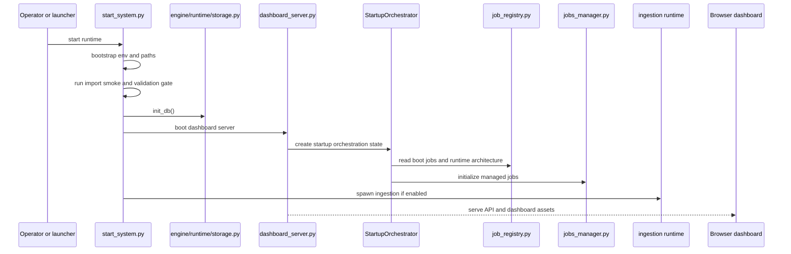
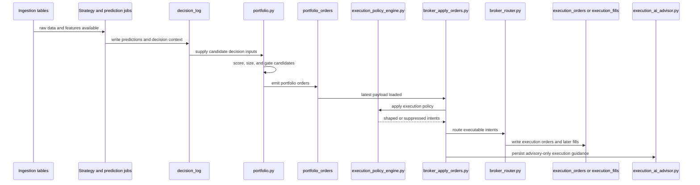
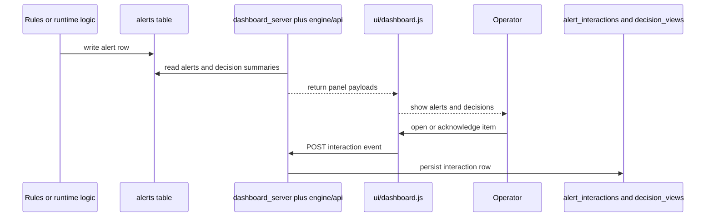
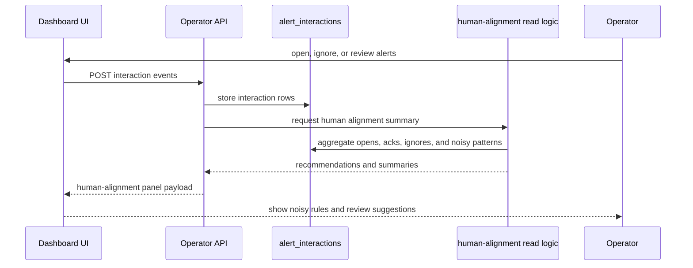
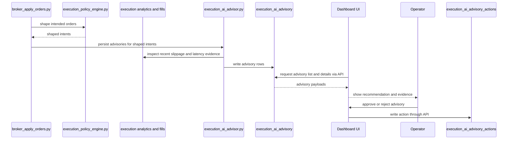
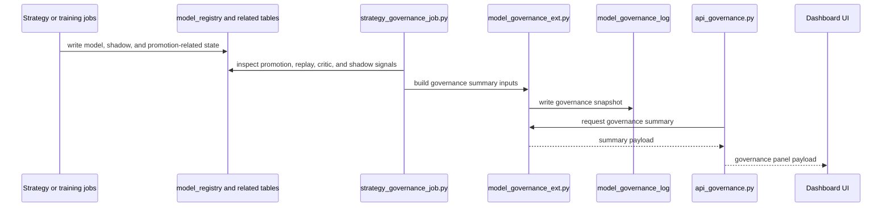
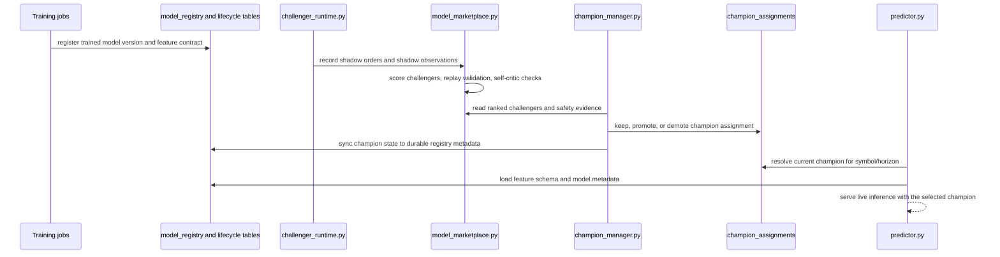
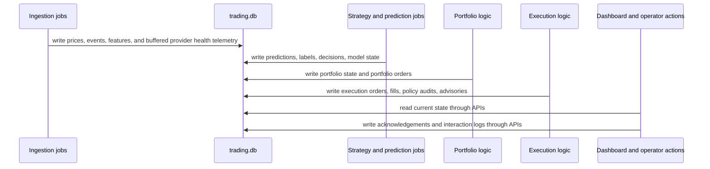

# Trading System Sequence Diagrams

This document shows the most important repo workflows as sequence diagrams.

It complements the architecture, database, and function maps by answering:

- what happens first
- what calls what
- what gets written to the database
- what the operator sees at the end

These are intentionally simplified. They show the main control path, not every helper or edge case.

## 1. Startup Flow

This is the main supervised startup path.

### Human explanation

The runtime does not just "start a script." It validates the environment, ensures the DB is ready, brings up the HTTP/UI boundary, initializes orchestration, and then supervises ingestion and other jobs.

## 2. Decision-To-Order Flow

This is the main trading path from signal to execution.

### Human explanation

The repo does not jump directly from model output to broker order. It passes through decision recording, portfolio shaping, policy checks, routing, and only then execution. The newer advisory layer observes that path and records guidance without taking authority over it.

## 3. Alert-To-Dashboard Flow

This is how alerts and decisions become operator-visible UI state.

### Human explanation

The dashboard is backed by persisted state, not just ephemeral in-memory events. When the operator opens a decision or interacts with an alert, that behavior can now be stored and later used by the human-alignment analytics layer.

## 4. Human-Alignment Analytics Flow

This is the passive oversight loop added during integration.

### Human explanation

This loop is deliberately passive. It studies operator behavior and recommends reviews, but it does not automatically retune alert thresholds.

## 5. Execution Advisory Flow

This is the advisory-only sidecar path.

### Human explanation

The advisory system is attached to execution but does not control execution. It watches what the system intends to do, checks recent realized execution history, and produces an auditable recommendation for the operator.

## 6. Governance And Promotion Flow

This is the main oversight path for model-governance state.

### Human explanation

Governance in this repo is not a single yes-no switch. It is a summary built from promotion status, replay freshness, critic signals, challenger/champion context, and shadow evidence. The dashboard now exposes that as a coherent view.

## 7. Champion-And-Challenger Flow

This is the live model-selection path.

### Human explanation

The champion/challenger system is not just "pick the highest score." A challenger first proves itself in shadow mode, then replay and self-critic gates can still block it, and only then can the champion manager assign it as live.

## 8. Database-Centered View

This is the same system seen through write order instead of code modules.

## 9. How To Use These Diagrams

### If you are debugging startup

Use:

- Startup Flow

### If you are debugging why a trade happened

Use:

- Decision-To-Order Flow
- Database-Centered View

### If you are debugging operator UI behavior

Use:

- Alert-To-Dashboard Flow
- Human-Alignment Analytics Flow

### If you are debugging model oversight or promotion issues

Use:

- Governance And Promotion Flow
- Champion-And-Challenger Flow

## 10. Short Summary

If you need the shortest explanation:

> The repo runs as a supervised pipeline: startup brings up orchestration and APIs, ingestion fills the database, strategy jobs create decisions, portfolio logic converts them into orders, execution logic shapes and routes those orders, and the dashboard exposes state plus newer oversight layers for decisions, human alignment, execution advisories, and governance.
