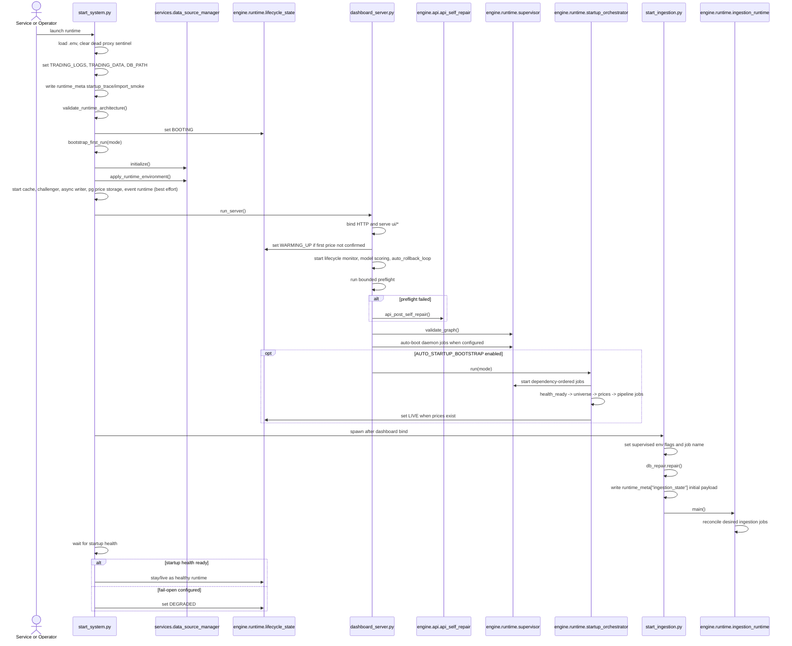
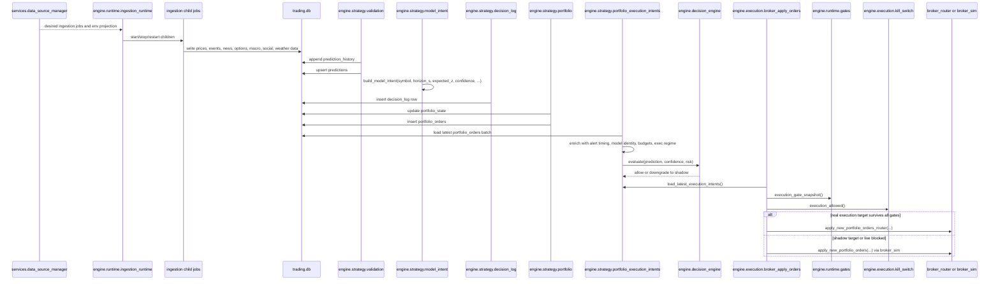
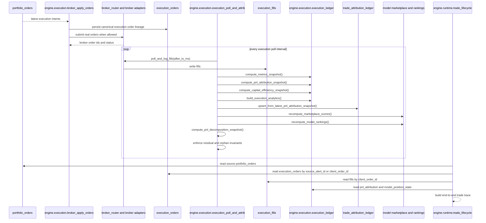
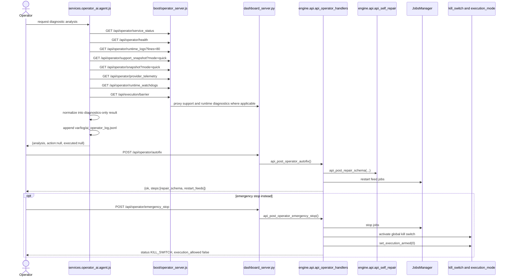
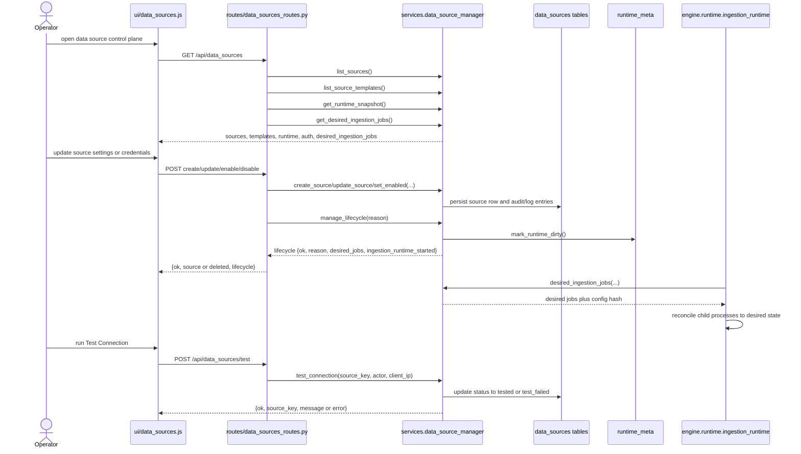

# Extended Sequence Diagrams

The diagrams below are grounded in the inspected startup entrypoints, runtime modules, route handlers, and UI callers. They are meant to be used during onboarding, incident response, and design review.

## 1. Startup

## 2. Ingest To Feature To Decision To Execution

What this diagram omits on purpose:

- the individual ingestion job implementations
- the full feature-engineering internals inside `process_events`
- the full execution-policy-engine shaping tree

Those subsystems exist, but the inspected code paths above are the stable cross-module boundaries.

## 3. Order To Fill To Attribution

Operationally important consequence:

- if `execution_orders` is present but `execution_fills` is not, the routing layer ran but post-trade polling did not complete
- if `execution_fills` exists but `pnl_attribution` does not, `execution_poll_and_attrib.py` has not finished or an invariant failed

## 4. Operator Diagnostics And Repair Path

Important distinction:

- `services/operator_ai/agent.js` is diagnostics-only
- `boot/operator_server.js` separately exposes AI patch preview/apply/rollback routes
- `engine.api.api_operator_handlers.py` owns the Python autofix and emergency-stop paths
- `services/operator_ai/agent.js` currently fetches `/api/execution/barrier` but does not assign that final response into the returned context object because its promise destructuring is offset by one slot

## 5. Data-Source Credential, Update, And Test Flow

Two debugging implications matter here:

- if the source row updates but `desired_ingestion_jobs` does not change, the problem is in template-to-job mapping, not ingestion supervision
- if `desired_ingestion_jobs` changes but the runtime stays stale, inspect `runtime_meta["data_sources_dirty"]`, `runtime_meta["data_sources_reload_ts_ms"]`, and the ingestion runtime reconciliation loop
