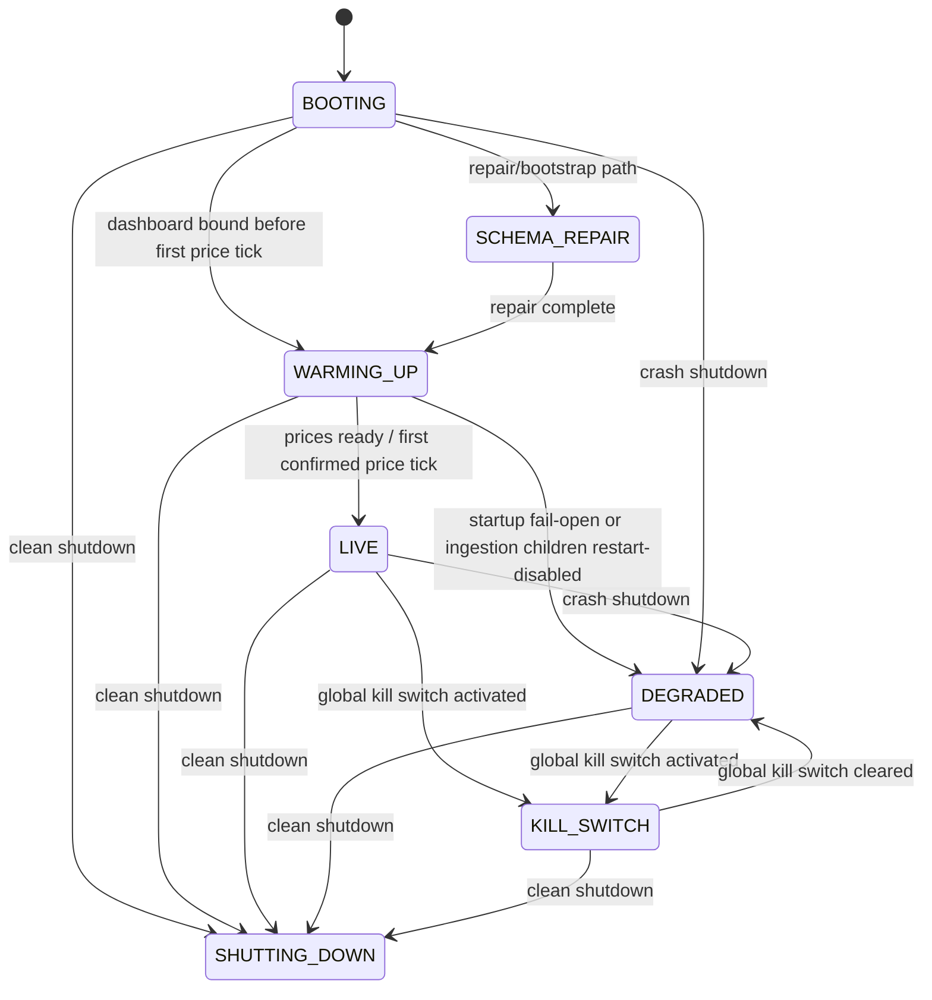
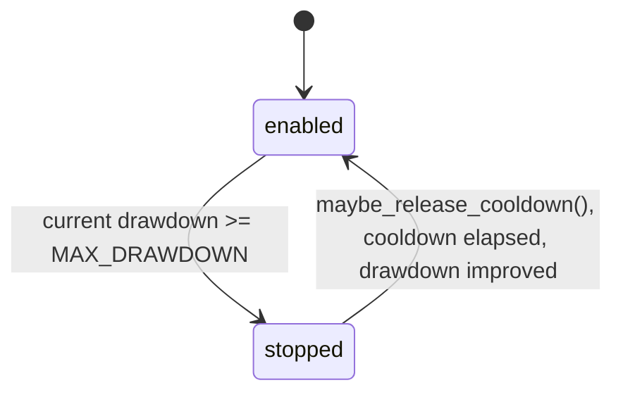
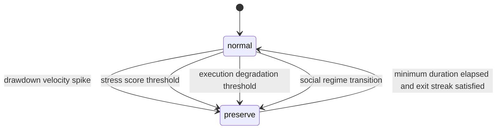
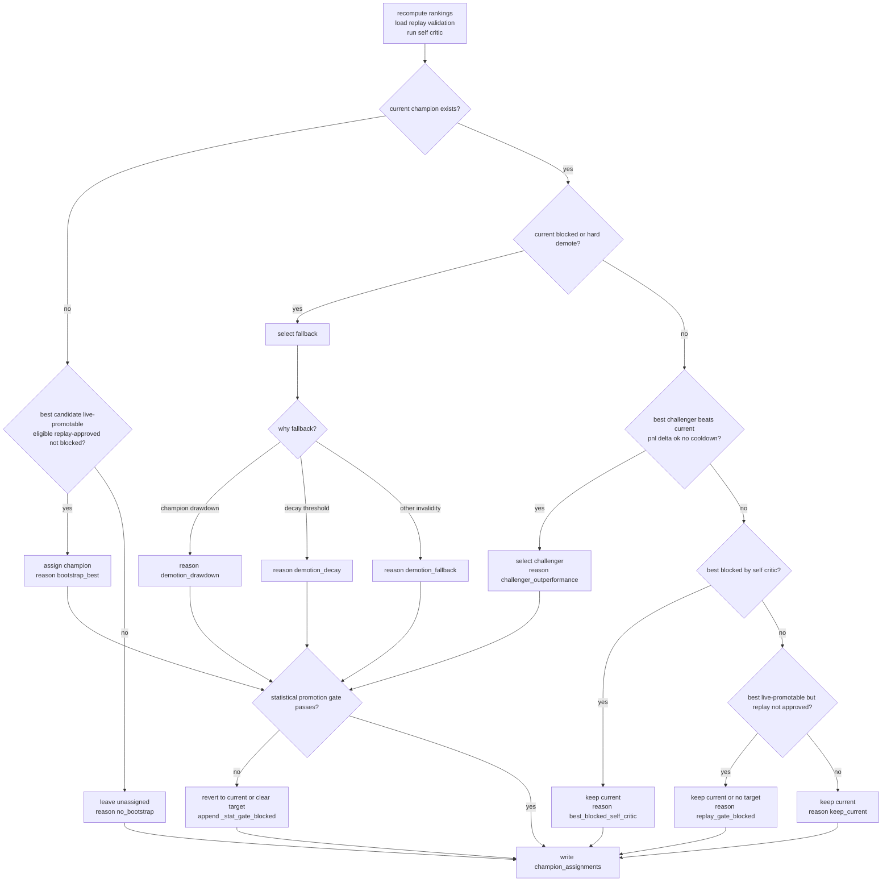
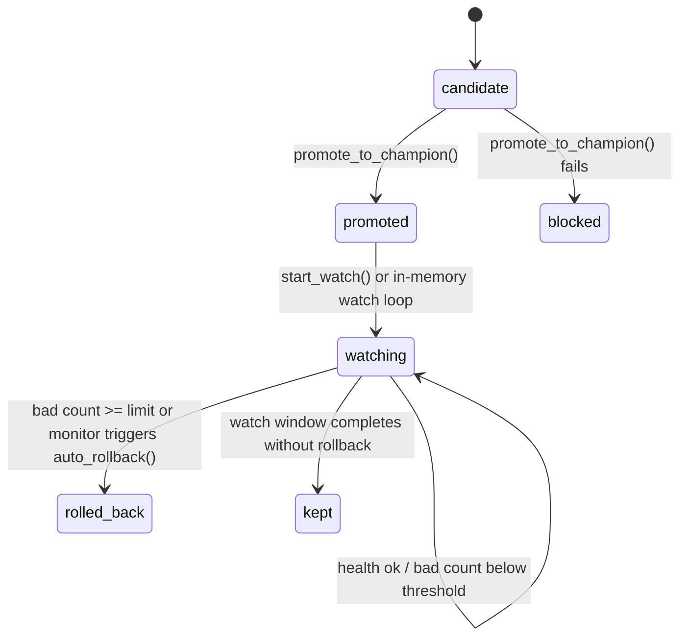
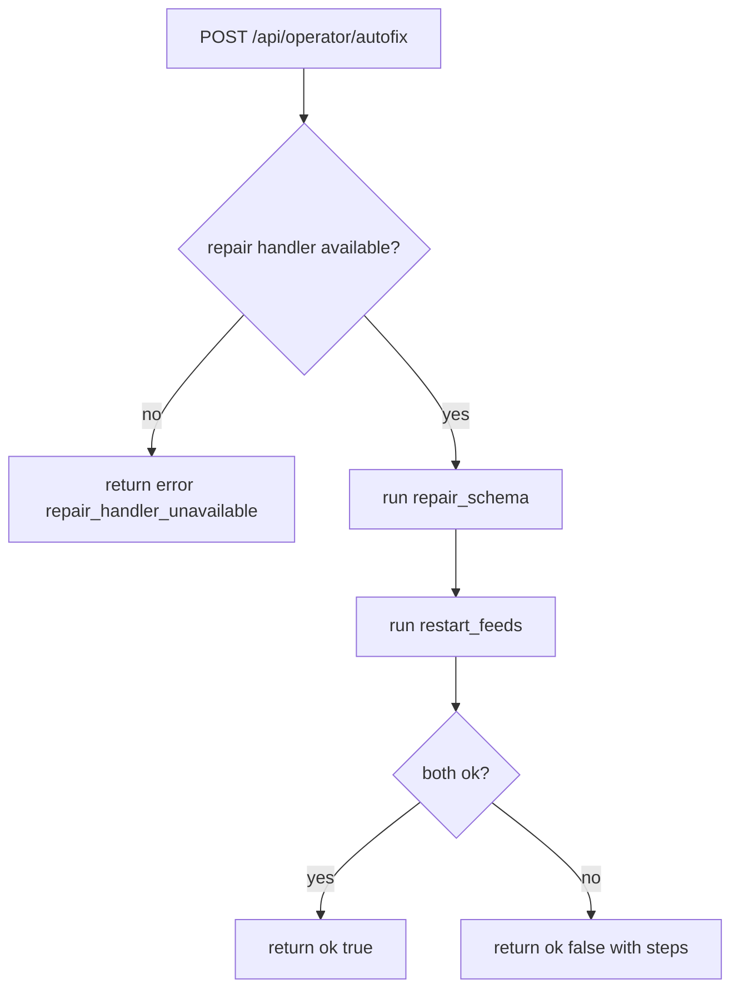

# State Machines

The diagrams below are limited to transitions and decision cascades that are directly evidenced in the inspected code:

- lifecycle states from `engine/runtime/lifecycle_state.py`
- startup and supervision flow from `start_system.py`, `dashboard_server.py`, `engine/runtime/startup_orchestrator.py`, and `engine/runtime/supervisor.py`
- execution blocking order from `engine/execution/kill_switch.py` and `engine/runtime/gates.py`
- capital guard transitions from `engine/strategy/capital_guard.py`
- champion/challenger and promotion-watch behavior from `engine/strategy/champion_manager.py`, `engine/strategy/promotion_guard.py`, and `engine/strategy/promotion_hardening.py`
- operator repair and patch gating from `engine/api/api_operator_handlers.py` and `boot/operator_server.js`

## 1. Runtime Lifecycle And Startup Supervision

### Lifecycle state machine



Operational notes:

- `start_system.py` explicitly sets `BOOTING`.
- `dashboard_server.py` moves the runtime into `WARMING_UP` when the HTTP server binds before the first confirmed price tick.
- `engine/runtime/lifecycle_state.py` blocks later callbacks from pulling the runtime back into `WARMING_UP` after `first_price_ts_ms` exists.
- `mark_crash_shutdown()` writes `DEGRADED`.
- global kill-switch activation sets lifecycle `KILL_SWITCH`; clearing it moves lifecycle to `DEGRADED`, not directly to `LIVE`.

### Startup and supervisor cascade

```mermaid
flowchart TD
    A[start_system.py bootstraps env<br/>TRADING_LOGS TRADING_DATA DB_PATH] --> B[validate_runtime_architecture()]
    B --> C[set lifecycle BOOTING]
    C --> D[bootstrap_first_run(mode)]
    D --> E[initialize DataSourceManager<br/>apply_runtime_environment()]
    E --> F[import dashboard_server.run_server()]
    F --> G[bind HTTP server first]
    G --> H[start lifecycle monitor<br/>model scoring<br/>auto_rollback_loop]
    H --> I[bounded preflight]
    I --> J{preflight ok?}
    J -->|no| K[api_post_self_repair()]
    J -->|yes| L[validate supervisor graph]
    K --> L
    L --> M[auto-boot daemon jobs from JOB_ORDER<br/>ingestion_runtime provider_monitor metrics_collector]
    M --> N[start StartupOrchestrator.run()]
    N --> O[health_ready]
    O --> P{symbols ready?}
    P -->|no| Q[run update_universe]
    P -->|yes| R{prices ready?}
    Q --> R
    R -->|no| S[start_poll_prices then retry]
    R -->|yes| T[run pipeline jobs]
    S --> T
    T --> U[poll_gdelt]
    U --> V[poll_sec_filings]
    V --> W[poll_earnings]
    W --> X[ingest_now]
    X --> Y[process_events]
    Y --> Z[label_due_events]
    Z --> AA[compute_drift]
    AA --> AB[train_embed_models]
    AB --> AC[train_model_v2]
    AC --> AD[validate_now]
    AD --> AE[process_events again]
    AE --> AF{prices exist?}
    AF -->|yes| AG[set lifecycle LIVE]
    AF -->|no| AH[start poll_prices guard<br/>remain warming or degrade]
```

This is the concrete startup order implemented by the inspected code. The supervisor itself is driven by `engine/runtime/job_registry.py` and `engine/runtime/supervisor.py`:

- daemon auto-boot targets come from `JOB_ORDER`
- oneshot dependency ordering comes from `PIPELINE_ORDER`
- `Supervisor.deterministic_start(..., include_deps=True)` topologically expands dependencies before starting jobs

## 2. Kill-Switch And Execution Block Cascade

### Detailed kill-switch decision cascade

This diagram follows the order in `engine.execution.kill_switch.execution_allowed(...)`.

```mermaid
flowchart TD
    A[execution_allowed()] --> B{lifecycle == LIVE?}
    B -->|no| B1[block<br/>reason from lifecycle]
    B -->|yes| C0{DISABLE_LIVE_EXECUTION truthy<br/>and mode live?}
    C0 -->|yes| C0A[block<br/>disable_live_execution_env]
    C0 -->|no| C{env kill switches active?}
    C -->|yes| C1[block<br/>env global/symbol/regime/model]
    C -->|no| D{capital_guard.trading_allowed()?}
    D -->|no| D1[block<br/>capital guard hard stop]
    D -->|yes| E{fresh prices events predictions?}
    E -->|no| E1[block<br/>stale data]
    E -->|yes| F{required job heartbeats fresh?}
    F -->|no| F1[block<br/>stale jobs]
    F -->|yes| G{capital-aware auto trigger?}
    G -->|yes| G1[activate global kill switch<br/>daily dd rolling dd VaR concentration]
    G1 --> G2[block and persist audit/risk event]
    G -->|no| H{model-aware auto trigger?}
    H -->|yes| H1[activate model kill switch<br/>model dd or consecutive losses]
    H1 --> H2[block and persist audit/risk event]
    H -->|no| I{DB kill switch active?}
    I -->|yes global| I1[block global]
    I -->|yes model| I2[block model]
    I -->|yes regime| I3[block regime]
    I -->|yes symbol| I4[block symbol]
    I -->|no| J[allow execution]
```

Operational notes:

- the DB kill-switch lookup order is global, then model, then regime, then symbol
- `DISABLE_LIVE_EXECUTION` is evaluated before capital/data/job checks for live-mode execution; any non-empty value except `0`, `false`, `no`, or `off` blocks with `disable_live_execution_env`
- a global activation also forces lifecycle `KILL_SWITCH`
- a global clear returns lifecycle to `DEGRADED`
- `broker_apply_orders.py` does not rely on this cascade alone; it also checks the broader runtime barrier from `execution_gate_snapshot()`

### Runtime barrier overlay

`engine.runtime.gates.execution_gate_snapshot(...)` sits in front of broker routing and terminal order-entry.

It hard-blocks or downgrades execution when any of the following are true:

- lifecycle is `BOOTING`, `SCHEMA_REPAIR`, `WARMING_UP`, `KILL_SWITCH`, `UNKNOWN`, or critically `DEGRADED`
- execution mode is non-executable
- execution degradation is critical
- portfolio risk state blocks execution
- active kill switches are present
- `DISABLE_LIVE_EXECUTION` is truthy while mode is `live`

The important distinction in that snapshot is:

- `allowed` means the execution pipeline may run
- `real_trading_allowed` means live trading may run

## 3. Capital Guard Transitions

`engine/strategy/capital_guard.py` persists two related but separate state families inside `risk_state`:

- `trading_state`: hard enable/stop state
- `capital_mode`: `normal` vs `preserve`

### Hard trading stop



Persisted keys involved:

- `trading_state`
- `stop_reason`
- `stop_ts_ms`

### Capital preservation mode



Persisted keys involved:

- `capital_mode`
- `capital_mode_ts_ms`
- `capital_mode_reason`
- `capital_mode_exit_streak`
- `capital_mode_snapshot_json`
- `capital_prev_drawdown`

Exit from `preserve` is not a single clean trigger. The code requires:

- the minimum preserve duration to have elapsed
- better conditions on drawdown velocity, stress, execution degradation, and social regime
- enough consecutive good checks to satisfy `CAPITAL_PRESERVE_EXIT_STREAK`

## 4. Champion, Challenger, Promotion, And Rollback

### Competition and assignment cascade

This diagram follows the branch structure in `engine.strategy.champion_manager.evaluate_competition_cycle()`.



The durable assignment table is `champion_assignments(scope, symbol, horizon_s, model_name, challenger_name, regime, state, assigned_ts_ms, updated_ts_ms, meta_json)`.

### Post-promotion watch and rollback

This diagram combines the bounded watch in `promote_with_snapshot_and_watch(...)` and the DB-backed watch in `promote_with_snapshot_and_db_watch(...)`.



Concrete watch behavior in the inspected code:

- the bounded in-memory watch defaults to `PROMOTE_WATCH_SECONDS=60`, `PROMOTE_WATCH_INTERVAL=5`, and `PROMOTE_WATCH_MAX_BAD=2`
- the DB-backed watch defaults to `POST_PROMO_WATCH_S=7200`
- rollback calls `rollback_champion(...)`
- DB-backed rollback also closes the watch row with `close_watch(..., "rolled_back", ...)`

Promotion is also globally gated by `engine.strategy.promotion_guard.promotion_allowed()`, which blocks on conditions such as:

- `disabled`
- `cooldown`
- `crit_alerts`
- `equity_drift_crit`
- `drift_ratio`
- `negative_real_pnl_models`

## 5. Operator Autofix And Patch Gating

### Fixed autofix path

`engine.api.api_operator_handlers.api_post_operator_autofix(...)` is a fixed two-step repair path, not an open-ended mutation path.



Returned steps are always:

- `repair_schema`
- `restart_feeds`

### AI patch apply and rollback gate

This diagram follows `boot/operator_server.js`.

```mermaid
flowchart TD
    A[POST /api/operator/ai/patch_preview] --> B[runAgent() returns analysis]
    B --> C[preview response]

    D[POST /api/operator/ai/apply_patch] --> E{confirm is APPLY_PATCH?}
    E -->|no| E1[block apply_patch_confirmation_required]
    E -->|yes| F{state.lastMode is not live?}
    F -->|no| F1[block apply_patch_blocked_in_live_mode]
    F -->|yes| G{analysis has file and patch object?}
    G -->|no| G1[block patch_file_missing or patch_missing]
    G -->|yes| H{confidence >= 0.85?}
    H -->|no| H1[block patch_confidence_too_low]
    H -->|yes| I[applyAiPatchWithBackup()]
    I --> J[write backup and metadata under data/operator/patches]
    J --> K[return applied patch info]

    L[POST /api/operator/ai/rollback_patch] --> M{confirm == ROLLBACK_PATCH?}
    M -->|no| M1[block rollback_patch_confirmation_required]
    M -->|yes| N[rollbackAiPatch(patchId)]
    N --> O[restore backup file]
```

Additional file-level guards in `applyAiPatchWithBackup(...)`:

- the target path must resolve inside the repo
- the extension must be one of the allowlisted text/code types
- the `find` text must match exactly once
- a no-op replacement is rejected

### Diagnostics-only AI module constraint

`services/operator_ai/agent.js` is intentionally outside this mutation path. Its `ALLOWED_ACTIONS` list is empty, so it can diagnose but not execute actions.
