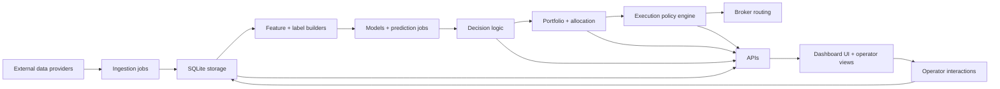

# Trading System — Handoff Document

**Purpose:** Upload this file into a Claude app Project (claude.ai → Projects → Trading System) so any new chat there starts with full context. Produced from a Claude Code session on 2026-04-11.

---

## 1. Project Goal (North Star)

Build an autonomous system that can by itself search a universe of inputs, discover which inputs are useful and which are not, and build models linking data inputs to predictions about what financial products of any kind can be traded for profit.

The ambition is "best in the world" — comparable to Renaissance Technologies, Two Sigma, WorldQuant, Citadel, Jane Street, Man AHL, Bridgewater. The current system is already substantial (~400+ Python files) and improvements build on existing architecture rather than replacing it.

**Every recommendation should be evaluated against this north star.** Favor automated discovery, self-evaluation, and closed-loop learning over manual configuration.

---

## 2. User Profile

Owner and primary developer of a comprehensive Python-based supervised trading system. Deep full-stack knowledge from data ingestion through execution. Thinks in terms of "best in the world" and compares the system to Renaissance/Two Sigma/WorldQuant. Prefers direct, technical responses without hand-holding.

---

## 3. System Architecture Audit (April 2026)

Full-stack supervised trading system, ~400+ Python files, SQLite (WAL mode), ~100+ registered jobs.

### Data Sources (10)
Prices (CCXT / IBKR / Polygon / yfinance), News/RSS (Reuters/Bloomberg/FT/WSJ), SEC/EDGAR, Social (Reddit/StockTwits), GDELT, Weather (NOAA), Options (Polygon), Earnings (FMP), Macro (CPI/GDP/Rates/Oil/Gas), Transcripts.

### Features
100+ named features in `engine/strategy/feature_registry.py` across 10 groups: base, price (30+), events, macro, tech, stress, social, weather, options, availability. Schema-driven train/serve parity — training writes a feature contract; serving reads the same contract back.

### ML Models (3 families + 1 shadow)
- **regime_stats_v2** — Bayesian priors + spillover betas (baseline)
- **embed_regressor** — Ridge + Torch MLP
- **temporal_predictor** — sequence model on embedding windows
- **RL linear policy** — shadow-only, no live execution authority

All managed through champion/challenger competition with: model marketplace, replay validation, self-critic, promotion cooldowns, drift detection, registry-backed feature schemas.

### Strategy Plane
Multi-model predictor routing, canonical model intent (`engine/strategy/model_intent.py`), portfolio construction (max 3 positions, anti-flip-flop, min hold), 3-layer regime stack (macro / asset-class / microstructure), alpha lifecycle with TTL and half-life decay, strategy selector (baseline/conservative).

### Risk
Portfolio risk engine (gross cap 1.0, net cap 0.6, vol targeting, correlation clusters), Monte Carlo (1500 sims, VaR/CVaR, 10-day horizon), drawdown guard (6% throttle start), circuit breaker, kill switch (global + per-model), trade suppression (HARD_BLOCK / SOFT_THROTTLE / SIZE_COMPRESSION).

### Execution
Policy engine (TTL, alpha decay, aggressiveness tiers, regime sizing), order slicing (TWAP / VWAP / POV / adaptive), broker router (Alpaca / IBKR / Sim with failover + pre-live position reconciliation gate), AI advisor (advisory only, no order authority), full attribution ledger.

### Oversight
Dashboard server + browser UI, operator AI (bounded LLM diagnostics, not a second autonomous runtime), governance jobs (promotion / replay / critic / audit), browser terminal.

### Architecture diagram

### The 5 runtime loops (+ 1 repair loop)
1. **Data loop** — ingest external data
2. **Signal loop** — features, labels, predictions
3. **Decision loop** — whether exposure should change
4. **Execution loop** — shape, check, route orders
5. **Oversight loop** — dashboard, alerts, governance, operator actions
6. **Repair loop** — support snapshots, watchdogs, operator AI (bounded recovery)

### Critical files
- `start_system.py`, `dashboard_server.py` — boot
- `engine/runtime/storage.py` — SQLite center of gravity
- `engine/runtime/job_registry.py` — canonical job catalog
- `engine/strategy/feature_registry.py` — feature catalog
- `engine/strategy/predictor.py` — live prediction + model routing
- `engine/strategy/champion_manager.py` — promotion logic
- `engine/strategy/model_intent.py` — canonical intent payload
- `engine/strategy/portfolio.py` — portfolio construction
- `engine/execution/broker_router.py` — broker failover
- `engine/execution/execution_policy_engine.py` — TTL, alpha decay, suppression
- `engine/risk/portfolio_risk_engine.py`, `engine/risk/monte_carlo_risk_engine.py` — risk

---

## 4. Gaps vs. World-Class Systems

Comparison against Renaissance, Two Sigma, WorldQuant, Citadel, Jane Street, Man AHL, Bridgewater, and academic SOTA (Gu/Kelly/Xiu 2020, Harvey/Liu/Zhu 2016, de Prado 2018, Almgren-Chriss 2000):

| Gap | Why it matters | Where to address |
|---|---|---|
| No multiple-hypothesis correction | ~95% of published factors are false positives (Harvey/Liu/Zhu). Current promotion doesn't correct for selection bias. | `champion_manager.py`, promotion guard |
| No automated feature discovery | WorldQuant's Alphas platform generates millions of candidates. System relies on hand-coded features. | `feature_registry.py`, new feature generation job |
| No Combinatorial Purged CV | Standard CV leaks across the time axis. de Prado's CPCV is the industry standard for robust backtesting. | New `engine/strategy/cpcv.py` + backtest job |
| No realistic transaction cost model | Missing Almgren-Chriss market impact model. | `engine/execution/execution_policy_engine.py` |
| Hardcoded hyperparameters (200+ env vars) | Should be Bayesian-optimized (Optuna). | Configuration surface across strategy/risk |
| No deep learning model families | Missing transformers (PatchTST/iTransformer), GNNs, TabNet, even LightGBM/XGBoost | New model families in `engine/strategy/` |
| No ensemble blending | Single champion wins; stacking would be more robust. | New `engine/strategy/ensemble_blender.py` |
| No causal discovery | Correlation-driven features. Missing Granger/DoWhy/DAG inference. | New research module |
| SQLite bottleneck | Industry uses TimescaleDB / kdb+ for time-series workloads at scale. | `engine/runtime/storage.py` — long-term migration |
| No streaming architecture | Batch ingestion limits responsiveness. Kafka would enable real-time signals. | Infrastructure, Phase 3 |
| Missing alt data | No satellite imagery, credit card proxies, Form 4 insider, congressional STOCK Act. | New ingestion jobs |
| No closed-loop alpha discovery | System has pieces but no end-to-end auto-generate → backtest → shadow → promote → retire loop. | Phase 4 work |
| No deep RL portfolio manager | FinRL / PPO / SAC could optimize portfolio directly. | Phase 4 work |
| No L2 microstructure modeling | Missing order book alpha — informed-trade detection, lead-lag. | Phase 5 work |

---

## 5. Five-Phase Optimization Roadmap

### Phase 1 (P0 CRITICAL — Months 1–3) — Foundation
- Multiple hypothesis testing: Benjamini-Hochberg FDR, Harvey/Liu/Zhu t>3.0 threshold, White's Reality Check
- Automated feature discovery: tsfresh (700+ auto features), PySR/gplearn (symbolic regression), combinatorial feature generator
- Rigorous backtesting: de Prado's Combinatorial Purged CV, Almgren-Chriss transaction costs, survivorship-bias correction
- Auto hyperparameter optimization: Optuna Bayesian optimization replacing hardcoded env vars

### Phase 2 (P1 HIGH — Months 3–6) — Intelligence
- Deep learning model families: PatchTST / iTransformer, Graph Attention Networks, TabNet, LightGBM/XGBoost as new families
- Enhanced NLP: FinBERT sentiment, LLM earnings call analysis, SEC filing diff detection
- Causal discovery: Granger causality, DoWhy / CausalML, DAG inference
- Ensemble blending: stacked generalization meta-learner instead of single champion selection

### Phase 3 (P1 — Months 6–9) — Scale
- Data infrastructure: SQLite → TimescaleDB, add Kafka streaming, Feast feature store, Redis caching
- Universe expansion: all US equities + global ETFs + full crypto + futures + FX, dynamic position limits
- Additional alt data: satellite imagery, credit card proxies, web scraping, Form 4 insider, congressional STOCK Act

### Phase 4 (P1–P2 — Months 9–12) — Autonomy
- Closed-loop alpha discovery: generate → test → backtest → shadow → promote → monitor → retire
- Meta-learning: cross-asset transfer, few-shot adaptation for new instruments
- Deep RL portfolio manager: PPO / SAC via FinRL, trained in `broker_sim`
- Self-monitoring & self-repair: automated drift-triggered retrain, P&L attribution decomposition

### Phase 5 (P2–P3 — 12+ months) — Edge
- Market microstructure: L2 order book modeling, lead-lag detection, informed-trade detection
- Event-driven alpha: earnings surprise prediction, M&A prediction, macro event positioning
- Options as instruments: direct options trading, vol surface arbitrage, systematic tail hedging

---

## 6. Five Immediate Quick Wins

Each is 1–2 weeks of focused work. Detailed, self-contained implementation prompts are in `docs/handoff/QUICK_WINS.md`.

1. **Harvey/Liu/Zhu t > 3.0 promotion threshold** — gate all new champions behind a t-statistic check with Deflated Sharpe Ratio and Benjamini-Hochberg FDR. Creates `engine/strategy/statistical_gates.py` and wires into `champion_manager.py`.
2. **de Prado Combinatorial Purged Cross-Validation** — new `engine/strategy/cpcv.py` with purge/embargo, CPCV splits, PBO computation, wired into promotion guard.
3. **tsfresh automated feature extraction** — 700+ auto-generated time-series features registered in `feature_registry.py` under a new `tsfresh.*` group.
4. **LightGBM model family** — new `engine/strategy/gbm_regressor.py` mirroring the `embed_regressor.py` pattern, routed through `predictor.py`.
5. **Stacked ensemble blending** — new `engine/strategy/ensemble_blender.py` with multiple blend modes (equal / inverse-variance / stacked / regime-conditional), opt-in via env flag.

**Recommended execution order:** 1 → 2 → 4 → 3 → 5
(Gates first so we know what to trust → rigorous backtesting → new model family → more features → blend everything.)

---

## 7. How to Use This Document

If you're starting a fresh chat in the Claude app Project:
1. This document is in the Project knowledge base — it loads automatically.
2. The companion `QUICK_WINS.md` contains 5 ready-to-execute implementation prompts.
3. For actual file edits and command execution, switch to Claude Code in VS Code at `C:\Users\dschi\Documents\GitHub\Trading-System-\`. The memory files there auto-load the same context.
4. When designing new work, consult the roadmap and favor automated/self-evaluating approaches that fit the model-vs-runtime contract (models propose, runtime gates).
