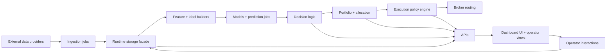

# Trading System — Handoff Document

**Purpose:** Upload this file into a Claude app Project (claude.ai -> Projects -> Trading System) so any new chat there starts with full context. Originally produced from a Claude Code session on 2026-04-11 and last verified against code on 2026-06-11.

---

## 1. Project Goal (North Star)

Build an autonomous system that can by itself search a universe of inputs, discover which inputs are useful and which are not, and build models linking data inputs to predictions about what financial products of any kind can be traded for profit.

The ambition is "best in the world" — comparable to Renaissance Technologies, Two Sigma, WorldQuant, Citadel, Jane Street, Man AHL, Bridgewater. The current system is already substantial (~400+ Python files) and improvements build on existing architecture rather than replacing it.

**Every recommendation should be evaluated against this north star.** Favor automated discovery, self-evaluation, and closed-loop learning over manual configuration.

---

## 2. User Profile

Owner and primary developer of a comprehensive Python-based supervised trading system. Deep full-stack knowledge from data ingestion through execution. Thinks in terms of "best in the world" and compares the system to Renaissance/Two Sigma/WorldQuant. Prefers direct, technical responses without hand-holding.

---

## 3. System Architecture Audit (Last verified 2026-06-11)

Full-stack supervised trading system, ~400+ Python files, Postgres-backed runtime storage facade, ~100+ registered jobs.

### Data Sources
Prices (CCXT / IBKR / Polygon / yfinance), News/RSS, SEC/EDGAR, Social (Reddit/StockTwits), GDELT, Weather (NOAA), Options (Polygon), Earnings (FMP), Macro, Transcripts, Form 4 insider data, congressional trades, and point-in-time universe snapshots.

### Features
Schema-driven train/serve parity through `engine/strategy/feature_registry.py`. The default serving set is about 111 feature ids; the full catalog is much larger when optional/shadow groups are enabled. Current groups include base, price, events, macro, HMM regime, tech, stress, social, weather, options-symbol, availability, tsfresh, NLP/FinBERT/news, filings, and transcripts.

### ML Models
- **LightGBM** — `engine/strategy/models/lgbm_regressor.py`
- **XGBoost** — `engine/strategy/models/xgb_regressor.py`
- **sklearn/GBM-style regressors** — `engine/strategy/models/gbm_model.py`, `engine/strategy/gbm_regressor.py`
- **PatchTST** — `engine/strategy/models/patchtst.py`
- **Ridge meta-ensemble** — `engine/strategy/ensemble/ridge_meta.py`
- **Legacy/fallback paths** — embed regressors, temporal predictors, and regime/statistical baselines still exist as schema-aware maintenance paths
- **Shadow RL** — advisory/shadow only, no live execution authority

All managed through champion/challenger competition with model marketplace, replay validation, self-critic, promotion cooldowns, drift detection, registry-backed feature schemas, CPCV/gated backtest evidence, statistical gates, pool/MPC gates, and era/regime robustness checks.

### Strategy Plane
Multi-model predictor routing, canonical model intent (`engine/strategy/model_intent.py`), portfolio construction (max 3 positions, anti-flip-flop, min hold), 3-layer regime stack (macro / asset-class / microstructure), alpha lifecycle with TTL and half-life decay, strategy selector (baseline/conservative).

### Risk
Portfolio risk engine (gross cap 1.0, net cap 0.6, vol targeting, correlation clusters), Monte Carlo (1500 sims, VaR/CVaR, 10-day horizon), drawdown guard (6% throttle start), circuit breaker, kill switch (global + per-model), trade suppression (HARD_BLOCK / SOFT_THROTTLE / SIZE_COMPRESSION).

### Execution
Policy engine (TTL, alpha decay, aggressiveness tiers, regime sizing), order slicing (TWAP / VWAP / POV / adaptive), broker router (Alpaca / IBKR / Sim with failover + pre-live position reconciliation gate), AI advisor (advisory only, no order authority), full attribution ledger.

### Oversight
Dashboard server + browser UI, operator AI (bounded LLM diagnostics, not a second autonomous runtime), governance jobs (promotion / replay / critic / audit), browser terminal.

### Architecture diagram

### The 5 runtime loops (+ 1 repair loop)
1. **Data loop** — ingest external data
2. **Signal loop** — features, labels, predictions
3. **Decision loop** — whether exposure should change
4. **Execution loop** — shape, check, route orders
5. **Oversight loop** — dashboard, alerts, governance, operator actions
6. **Repair loop** — support snapshots, watchdogs, operator AI (bounded recovery)

### Critical files
- `start_system.py`, `dashboard_server.py` — boot
- `engine/runtime/storage.py` — runtime storage facade
- `engine/runtime/job_registry.py` — canonical job catalog
- `engine/strategy/feature_registry.py` — feature catalog
- `engine/strategy/predictor.py` — live prediction + model routing
- `engine/strategy/champion_manager.py` — promotion logic
- `engine/strategy/model_intent.py` — canonical intent payload
- `engine/strategy/portfolio.py` — portfolio construction
- `engine/execution/broker_router.py` — broker failover
- `engine/execution/execution_policy_engine.py` — TTL, alpha decay, suppression
- `engine/risk/portfolio_risk_engine.py`, `engine/risk/monte_carlo_risk_engine.py` — risk

---

## 4. Remaining Gaps vs. World-Class Systems

Comparison against Renaissance, Two Sigma, WorldQuant, Citadel, Jane Street, Man AHL, Bridgewater, and academic SOTA (Gu/Kelly/Xiu 2020, Harvey/Liu/Zhu 2016, de Prado 2018, Almgren-Chriss 2000):

| Gap | Why it matters | Where to address |
|---|---|---|
| Scale-out storage/streaming still incomplete | Current storage has a Postgres-backed facade, but Kafka-style event streaming and dedicated feature-store/hot-cache layers are not fully built. | `engine/runtime/`, ingestion runtime, Phase 3 infrastructure |
| Universe and instrument coverage still narrower than the north star | More US equities, global ETFs, futures, FX, and direct options execution remain future expansion. | universe, data, execution |
| More alternative data remains valuable | Form 4 and congressional paths exist, but satellite, credit-card proxies, deeper web data, and richer transcript workflows are not complete. | `engine/data/jobs/`, `engine/strategy/feature_registry.py` |
| Graph/iTransformer/TabNet families not yet first-class | LightGBM/XGBoost/GBM/PatchTST landed, but broader deep tabular/graph sequence families are still open. | `engine/strategy/models/` |
| Closed-loop alpha discovery is partial | Discovery, evaluation, backtest, shadow, and promotion pieces exist, but the full auto-generate -> backtest -> shadow -> promote -> retire loop still needs orchestration hardening. | discovery, promotion, governance jobs |
| Deep RL portfolio manager remains future work | Shadow RL exists, but no PPO/SAC live allocator has authority. | `engine/strategy/jobs/run_rl_shadow.py`, future RL modules |
| L2 microstructure and direct options strategies remain future edge work | Current execution handles broker routing and cost/slippage realism, but L2 alpha and systematic options strategies are not fully built. | `engine/execution/`, future data sources |
---

## 5. Five-Phase Optimization Roadmap

### Phase 1 (P0 CRITICAL — Months 1–3) — Foundation
- DONE: Multiple hypothesis testing via Benjamini-Hochberg FDR, Harvey/Liu/Zhu thresholding, White's Reality Check, and deflated Sharpe.
- DONE: Automated feature discovery hooks via tsfresh and PySR/symbolic feature paths.
- DONE/PARTIAL: Rigorous backtesting via CPCV/PBO, cost-adjusted metrics, gated backtests, retrain-cadence replay, and PIT universe support; continue hardening survivorship-bias and data-hygiene coverage.
- DONE/PARTIAL: Optuna tuning and parameter-surface robustness; broader config cleanup remains ongoing.

### Phase 2 (P1 HIGH — Months 3–6) — Intelligence
- DONE/PARTIAL: LightGBM, XGBoost, sklearn GBM, PatchTST, FinBERT/NLP feature groups, causal diagnostics, Ridge meta-ensemble, and shadow RL are present.
- FUTURE: iTransformer, graph models, TabNet, richer LLM transcript/filing workflows, and live-authority deep RL remain open.

### Phase 3 (P1 — Months 6–9) — Scale
- Data infrastructure: continue Postgres/runtime-storage hardening; add Kafka streaming, Feast feature store, and Redis caching
- Universe expansion: all US equities + global ETFs + full crypto + futures + FX, dynamic position limits
- Additional alt data: satellite imagery, credit card proxies, web scraping, Form 4 insider, congressional STOCK Act

### Phase 4 (P1–P2 — Months 9–12) — Autonomy
- Closed-loop alpha discovery: generate → test → backtest → shadow → promote → monitor → retire
- Meta-learning: cross-asset transfer, few-shot adaptation for new instruments
- Deep RL portfolio manager: PPO / SAC via FinRL, trained in `broker_sim`
- Self-monitoring & self-repair: automated drift-triggered retrain, P&L attribution decomposition

### Phase 5 (P2–P3 — 12+ months) — Edge
- Market microstructure: L2 order book modeling, lead-lag detection, informed-trade detection
- Event-driven alpha: earnings surprise prediction, M&A prediction, macro event positioning
- Options as instruments: direct options trading, vol surface arbitrage, systematic tail hedging

---

## 6. Five Immediate Quick Wins

These were originally 1-2 week implementation prompts. They are now DONE in the current code and preserved in `docs/handoff/QUICK_WINS.md` as a historical prompt archive.

1. **DONE — Statistical promotion gates** — `engine/strategy/statistical_gates.py`, `engine/strategy/promotion_guard.py`, `engine/strategy/promotion_audit.py`
2. **DONE — CPCV / PBO / gated promotion backtests** — `engine/strategy/cpcv.py`, `engine/strategy/gated_backtest.py`, `engine/strategy/jobs/backtest_cpcv.py`
3. **DONE — tsfresh automated feature extraction** — `engine/strategy/tsfresh_features.py`, `engine/data/jobs/compute_tsfresh_snapshots.py`, `engine/strategy/feature_registry.py`
4. **DONE — LightGBM/XGBoost/GBM/PatchTST families** — `engine/strategy/models/`, `engine/strategy/jobs/train_lgbm_models.py`, `engine/strategy/jobs/train_xgb_models.py`, `engine/strategy/jobs/train_patchtst_models.py`
5. **DONE — Ridge meta-ensemble blending** — `engine/strategy/ensemble/ridge_meta.py`, `engine/strategy/jobs/train_ensemble_meta.py`

Historical execution order was 1 -> 2 -> 4 -> 3 -> 5.

---

## 7. How to Use This Document

If you're starting a fresh chat in the Claude app Project:
1. This document is in the Project knowledge base — it loads automatically.
2. The companion `QUICK_WINS.md` is a historical prompt archive; its quick wins are marked DONE with module pointers.
3. For actual file edits and command execution, work in the active Trading-System checkout. This verification pass used `/home/david/gitsandbox/system/system`.
4. When designing new work, consult the roadmap and favor automated/self-evaluating approaches that fit the model-vs-runtime contract (models propose, runtime gates).
